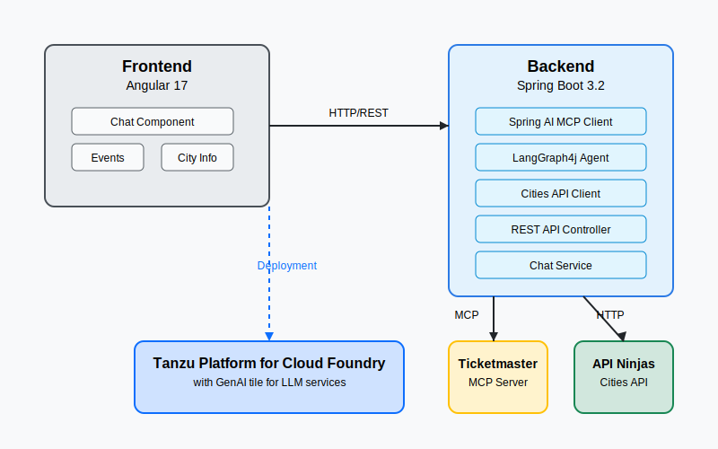

# Event Recommendation Chatbot


A chatbot application that recommends events based on user preferences and location, using Spring Boot, LangGraph, Model Context Protocol (MCP), and Angular.



## Overview

This application demonstrates the use of the Tanzu Platform for Cloud Foundry's GenAI capabilities to create an intelligent event recommendation chatbot. It leverages the following technologies:

- **Backend**: Java 17, Spring Boot 3.2, Spring AI
- **Agent Orchestration**: LangGraph4j
- **External Integration**: Model Context Protocol (MCP), API Ninjas Cities API
- **Frontend**: Angular 17
- **Deployment**: Tanzu Platform for Cloud Foundry

## Features

- **Conversational Interface**: Natural language chat interface for users to inquire about events
- **City Information**: Integration with Cities API to provide information about cities
- **Event Recommendations**: Integration with Ticketmaster API via MCP to provide relevant event recommendations
- **Intelligent Agent**: LangGraph-powered agent that maintains conversation context and provides coherent responses

## Repository Structure

```
java-spring-langgraph-mcp-angular/
├── backend/                      # Spring Boot backend application
│   ├── src/                      # Source code
│   │   ├── main/
│   │   │   ├── java/...          # Java code
│   │   │   └── resources/        # Configuration files
│   │   └── test/                 # Test code
│   └── README.md                 # Backend documentation
├── frontend/                     # Angular frontend application
│   ├── src/                      # Source code
│   │   ├── app/                  # Angular components, services, etc.
│   │   ├── assets/               # Static assets
│   │   └── environments/         # Environment configurations
│   └── README.md                 # Frontend documentation
├── scripts/                      # Utility scripts
│   └── deploy-to-tanzu.sh        # Deployment script
├── IMPLEMENTATION.md             # Implementation details
├── manifest.yml                  # Cloud Foundry manifest
└── pom.xml                       # Maven project configuration
```

## Prerequisites

- Java 17 or later
- Node.js 20 or later and npm
- Maven 3.8 or later
- Cloud Foundry CLI for deployment
- Ticketmaster API key
- API Ninjas API key

## Quick Start

### Local Development

1. **Clone the repository:**

```bash
git clone <repository-url>
cd java-spring-langgraph-mcp-angular
```

2. **Set up environment variables:**

```bash
export TICKETMASTER_API_KEY=your-api-key
export CITIES_API_KEY=your-api-key
```

3. **Build and run the application:**

```bash
mvn clean install
cd backend
mvn spring-boot:run
```

4. **Access the application:**

Open your browser and navigate to `http://localhost:8080`

### Deployment to Tanzu Platform for Cloud Foundry

1. **Log in to your Tanzu Platform for Cloud Foundry environment:**

```bash
cf login -a <api-endpoint> --sso
```

2. **Run the deployment script:**

```bash
./scripts/deploy-to-tanzu.sh
```

## Implementation Details

The application is built using Spring Boot for the backend and Angular for the frontend. It integrates with the Ticketmaster API using the Model Context Protocol (MCP) and the API Ninjas Cities API to provide event recommendations and city information.

The chatbot agent is built using LangGraph4j, which provides a framework for creating stateful, multi-step conversation flows. The agent understands user intent, fetches city information, searches for events, and generates natural language responses.

For more details, see the [IMPLEMENTATION.md](IMPLEMENTATION.md) file.

## Configuration

### Backend Configuration

Backend configuration is managed through `application.properties` and environment-specific properties files. Key configuration properties include:

- `spring.ai.mcp.client.stdio.connections.ticketmaster`: Ticketmaster MCP configuration
- `cities.api.url`, `cities.api.key`: Cities API configuration
- `spring.ai.openai`: OpenAI configuration for direct LLM usage (optional)

See the [backend README](backend/README.md) for more details.

### Frontend Configuration

Frontend configuration is managed through Angular environment files. Key configuration includes:

- `apiUrl`: Backend API URL

See the [frontend README](frontend/README.md) for more details.

## Developer Guide

### Adding New Features

1. **Backend**: Extend the relevant Spring components and update the LangGraph agent as needed.
2. **Frontend**: Add new Angular components and update the services to interact with the backend.

### Testing

Run backend tests with Maven:

```bash
mvn test
```

Run frontend tests with Angular CLI:

```bash
cd frontend
npm test
```

## License

This project is licensed under the [MIT License](LICENSE).

## Acknowledgments

- [Spring AI](https://github.com/spring-projects/spring-ai) for the Spring AI integration
- [LangGraph4j](https://github.com/bsorrentino/langgraph4j) for the LangGraph Java implementation
- [Ticketmaster API](https://developer.ticketmaster.com/) for the event data
- [API Ninjas](https://api-ninjas.com/) for the city data
- [Tanzu Platform for Cloud Foundry](https://tanzu.vmware.com/application-service) for the deployment platform
