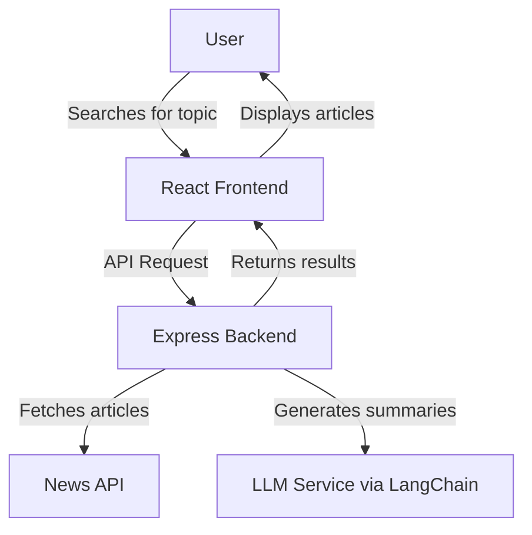

# LangChain + React News Aggregator

 

## What is it?

This application is a news aggregation tool built with React and LangChain that can be deployed to Tanzu Platform for Cloud Foundry and integrate with LLM services through the GenAI tile. It allows users to search for news on any topic, retrieves recent articles with source links, and generates concise 25-word summaries using an LLM.

## Key Features

- **Topic-based News Search**: Search for news articles on any topic
- **AI-powered Summaries**: Automatically generates concise 25-word summaries of each article
- **Responsive Design**: Works on desktop and mobile devices
- **Cloud Foundry Ready**: Optimized for deployment on Tanzu Platform for Cloud Foundry
- **GenAI Integration**: Seamlessly connects with LLM services through the GenAI tile

## Architecture

The application follows a modern JavaScript architecture with a React frontend and Express backend:



View the [detailed architecture documentation](docs/ARCHITECTURE.md) for a comprehensive explanation of the application components and how they interact.

## Prerequisites

- Node.js 18+ and npm
- Cloud Foundry CLI (for deployment)
- Access to Tanzu Platform for Cloud Foundry with GenAI tile installed
- News API key (for development)

## Quick Start

1. Clone the repository:

   ```bash
   git clone https://github.com/cf-toolsuite/tanzu-genai-showcase
   cd tanzu-genai-showcase/js-langchain-react
   ```

2. Install dependencies:

   ```bash
   npm install
   ```

3. Create a `.env` file with your API keys:

   ```bash
   REACT_APP_API_BASE_URL=http://localhost:3001
   API_KEY=your_llm_api_key_here
   NEWS_API_KEY=your_news_api_key_here
   ```

4. Build the React application:

   ```bash
   npm run build
   ```

   > **Important**: This step is required before starting the server, as the Express backend is configured to serve the built React app.

5. Start the development servers:

   ```bash
   # Option 1: Using the start script (recommended)
   ./start-app.sh

   # Option 2: Using npm directly
   npm run dev
   ```

5. Open your browser to `http://localhost:3000`

   > **Note**: If port 3001 is already in use, the `start-app.sh` script will:
   > - Detect the port conflict
   > - Ask if you want to kill the process using port 3001
   > - If you choose not to kill the process, it will automatically:
   >   - Find an available port
   >   - Update your `.env` file with the correct API base URL
   >   - Start the application with the new configuration
   >
   > This ensures that the frontend and backend always use the same port.

## Updating Dependencies

To update the project dependencies to the latest versions and fix deprecated packages:

```bash
# Make the script executable if needed
chmod +x update-dependencies.sh

# Run the update script
./update-dependencies.sh
```

This script will:

- Configure npm to use secure TLS
- Remove existing node_modules and package-lock.json
- Install the updated dependencies
- Run npm audit fix to address any remaining issues

For more details about dependency management, see the [Dependencies documentation](docs/DEPENDENCIES.md).

## Documentation

- [Architecture](docs/ARCHITECTURE.md): System design and component interactions
- [Development](docs/DEVELOPMENT.md): Local development setup and workflow
- [Deployment](docs/DEPLOYMENT.md): Cloud Foundry deployment instructions
- [API](docs/API.md): API documentation and endpoints
- [Dependencies](docs/DEPENDENCIES.md): Dependency management and updates
- [Testing](docs/TESTING.md): Testing strategies and procedures
- [Troubleshooting](docs/TROUBLESHOOTING.md): Common issues and solutions

## Tech Stack

- **Frontend**: React 18, CSS3, Axios
- **Backend**: Express.js, Node.js
- **AI/ML**: LangChain.js, OpenAI compatible LLMs
- **External APIs**: News API
- **Deployment**: Cloud Foundry, Tanzu Platform

## Project Structure

```
js-langchain-react/
├── public/                 # Static assets
├── src/                    # Frontend source code
│   ├── components/         # React components
│   │   ├── NewsItem.js     # Individual article display
│   │   ├── NewsList.js     # Article list container
│   │   └── NewsSearch.js   # Search form component
│   ├── services/           # Service integrations
│   │   └── newsService.js  # API client for news
│   ├── App.js              # Main application component
│   └── index.js            # Application entry point
├── server.js               # Express backend
├── .env.example            # Example environment variables
├── package.json            # Project dependencies
├── manifest.yml            # Cloud Foundry manifest
├── update-dependencies.sh  # Script to update dependencies
├── start-app.sh            # Script to start the application
├── fix-dependencies.sh     # Script to fix dependency issues
├── fix-watchers.sh         # Script to fix file watcher limits
└── docs/                   # Documentation
```

## License

This project is licensed under the terms of the MIT license.
