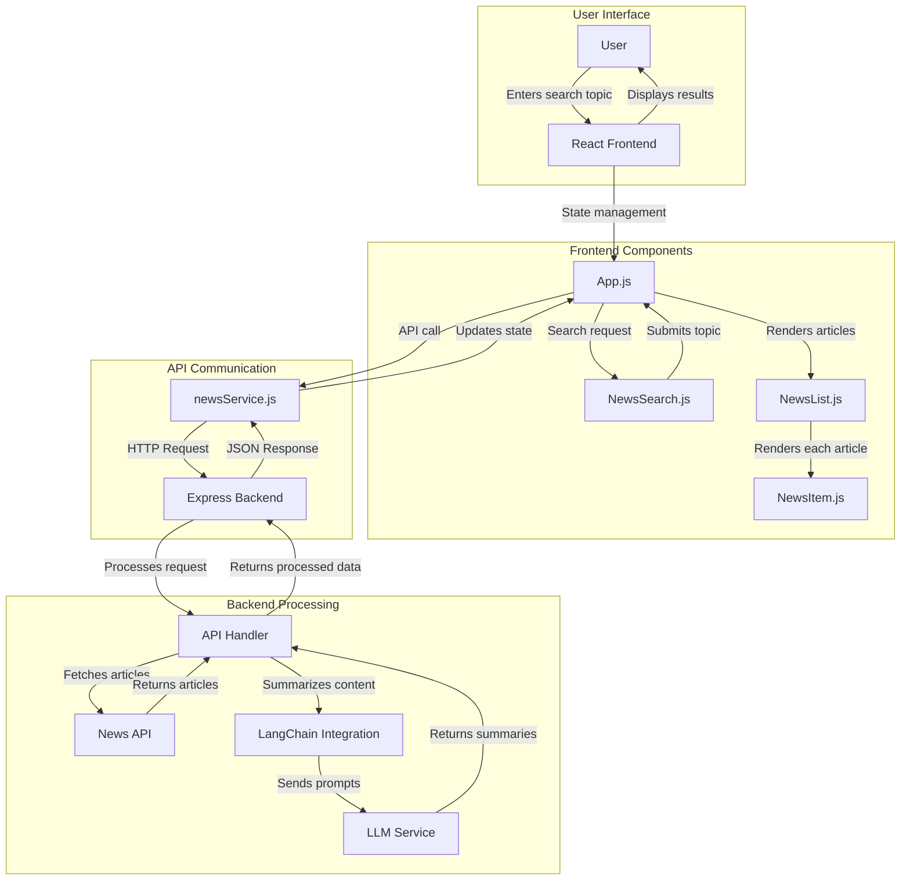
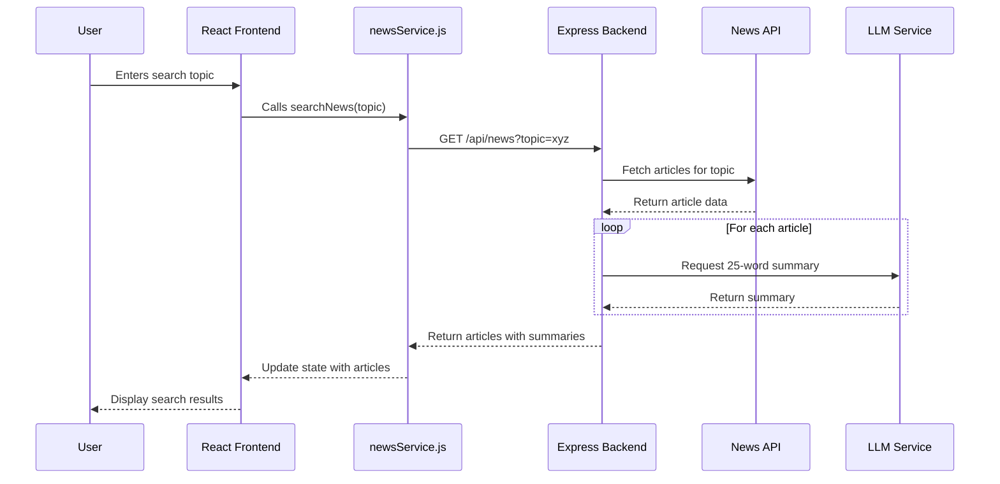
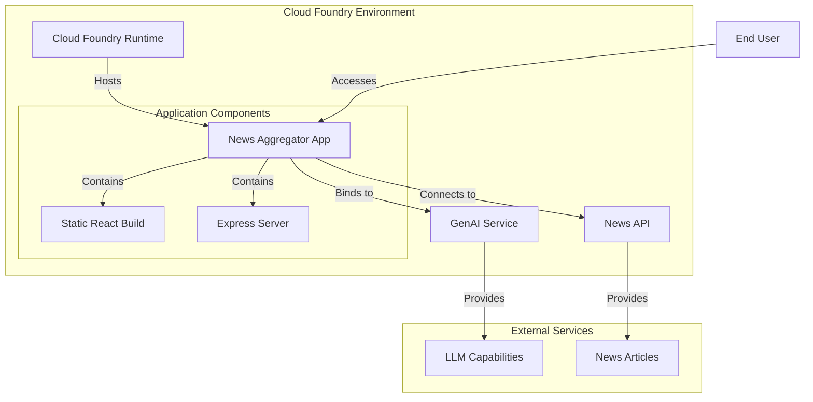

# Architecture Documentation

This document provides a comprehensive overview of the News Aggregator application architecture, detailing how the frontend and backend components interact to deliver the functionality.

## System Overview

The News Aggregator is a full-stack JavaScript application that combines:

- A React frontend for user interaction
- An Express backend for API processing
- LangChain integration for LLM orchestration
- External API connectivity for news data retrieval

The application follows a modern client-server architecture where the frontend makes API calls to the backend, which in turn processes these requests by communicating with external services.

## Architecture Diagram

## Component Details

### Frontend (React)

The frontend is a React application organized into the following key components:

#### App.js

- **Purpose**: Main application component that orchestrates the overall UI
- **Responsibilities**:
  - Manages application state (articles, loading, error)
  - Handles the search workflow
  - Renders child components
- **Key State Variables**:
  - `articles`: Array of news articles with summaries
  - `loading`: Boolean indicating if a search is in progress
  - `error`: Error message if the search fails
  - `searchPerformed`: Boolean tracking if a search has been executed

#### NewsSearch.js

- **Purpose**: Search form component for user input
- **Responsibilities**:
  - Captures the user's topic input
  - Validates form input
  - Triggers search via callback to parent
- **Props**:
  - `onSearch`: Callback function to initiate search

#### NewsList.js

- **Purpose**: Container for displaying news article results
- **Responsibilities**:
  - Renders a collection of NewsItem components
  - Handles the layout of search results
- **Props**:
  - `articles`: Array of article objects to display

#### NewsItem.js

- **Purpose**: Individual news article display
- **Responsibilities**:
  - Renders article details (title, source, summary, etc.)
  - Displays article image if available
  - Provides link to original article
- **Props**:
  - `article`: Object containing article data
- **Features**:
  - Date formatting
  - Conditional image rendering
  - External link handling

#### newsService.js

- **Purpose**: Service module for API communication
- **Responsibilities**:
  - Makes HTTP requests to the backend API
  - Handles API response formatting
  - Manages API errors
- **Key Functions**:
  - `searchNews(topic)`: Fetches news articles for a given topic
- **Environment Handling**:
  - Automatically detects development vs. production environment
  - Uses appropriate API base URL based on environment

### Backend (Express)

The backend is an Express.js server with the following components:

#### server.js

- **Purpose**: Main server application
- **Responsibilities**:
  - Sets up Express middleware
  - Defines API routes
  - Manages connections to external services
  - Handles Cloud Foundry environment integration
- **Key Middleware**:
  - CORS handling
  - JSON parsing
  - Static file serving
  - Rate limiting

#### LLM Integration

- **Purpose**: Integration with Large Language Models via LangChain
- **Responsibilities**:
  - Creates and manages LLM client
  - Sends article data for summarization
  - Processes LLM responses
- **Implementation Details**:
  - Uses ChatOpenAI from LangChain
  - Configures model parameters (temperature, etc.)
  - Handles prompt engineering for summarization

#### Environment Configuration

- **Purpose**: Handle configuration for different environments
- **Responsibilities**:
  - Detect Cloud Foundry VCAP_SERVICES for production
  - Use local .env variables for development
  - Configure API keys and endpoints
- **Configuration Hierarchy**:
  1. Cloud Foundry VCAP_SERVICES (production)
  2. Environment variables (multiple fallback options)
  3. Default values where appropriate

### External Services

The application interacts with two primary external services:

#### News API

- **Purpose**: Source of news article data
- **Responsibilities**:
  - Provides searchable news articles
  - Returns article metadata (title, description, source, etc.)
- **Integration Method**:
  - REST API calls with API key authentication
  - Endpoint: `https://newsapi.org/v2/everything`

#### LLM Service (GenAI)

- **Purpose**: Natural language processing for article summarization
- **Responsibilities**:
  - Generates concise article summaries
  - Processes natural language instructions
- **Integration Method**:
  - LangChain.js framework
  - Compatible with OpenAI API and similar LLM services
  - Supports custom endpoints via service binding

## Data Flow

1. **User Interaction**:
   - User enters a topic in the search form
   - Frontend submits search request to newsService.js

2. **API Request**:
   - newsService.js sends HTTP GET request to `/api/news` endpoint
   - Request includes the search topic as a query parameter

3. **Backend Processing**:
   - Express server receives the request
   - Server queries the News API for relevant articles
   - For each article, server sends content to LLM for summarization via LangChain

4. **LLM Processing**:
   - LangChain orchestrates communication with the LLM service
   - LLM generates concise summaries for each article
   - System prompt instructs LLM to create exactly 25-word summaries

5. **Response Handling**:
   - Backend collects all articles with summaries
   - Returns formatted JSON response to frontend

6. **UI Update**:
   - Frontend receives the response
   - Updates React state with article data
   - Renders NewsList and NewsItem components with the results

## Deployment Architecture

The application is designed to be deployed on Tanzu Platform for Cloud Foundry:

1. **Cloud Foundry Runtime**:
   - Application packaged as a Node.js app
   - Configuration via manifest.yml
   - Memory allocation optimized for Node.js and React build

2. **Service Binding**:
   - Automatic detection of VCAP_SERVICES
   - Binding to GenAI service for LLM functionality
   - Smart credential extraction with fallbacks

3. **Environment Variables**:
   - API keys and endpoints configured via environment
   - Fallback to local variables for development
   - Secure handling of credentials

## Security Considerations

1. **API Keys**:
   - News API key stored securely in environment variables
   - LLM API keys managed through service binding
   - No hardcoded credentials in source code

2. **Data Processing**:
   - All LLM processing done server-side
   - No sensitive user data stored or processed
   - CORS configured for appropriate access control

3. **Error Handling**:
   - Proper error handling to prevent information leakage
   - Graceful degradation when services are unavailable
   - User-friendly error messages

## Performance Considerations

1. **Parallel Processing**:
   - Articles are summarized in parallel using Promise.all
   - Reduces overall response time
   - Handles failures of individual summary requests

2. **Error Handling**:
   - Graceful degradation if LLM summarization fails
   - Falls back to article description when summary unavailable
   - Comprehensive error logging

3. **Optimization Opportunities**:
   - Implement caching for frequent searches
   - Add pagination for large result sets
   - Optimize image loading with lazy loading

## Development Workflow

1. **Local Development**:
   - Frontend and backend run on separate ports (3000 and 3001)
   - concurrently package runs both services for development
   - Hot reloading for React components

2. **Build Process**:
   - React app built to static files
   - Express serves static files in production
   - Optimized bundle size

3. **Deployment**:
   - Single command deployment via cf push
   - Service binding via cf bind-service
   - Environment variable configuration via manifest.yml
