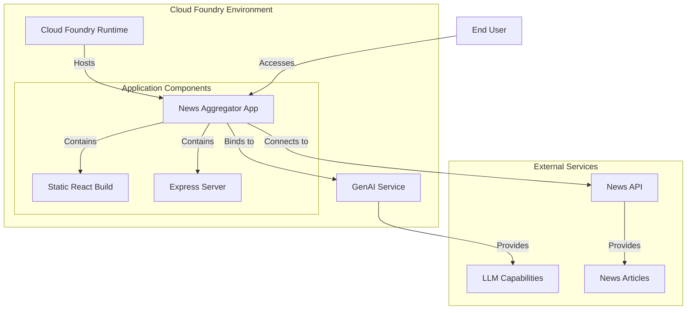

# Deployment Guide

This document provides detailed instructions for deploying the News Aggregator application to Tanzu Platform for Cloud Foundry and troubleshooting common deployment issues.

## Deployment Architecture

The News Aggregator is deployed as a **single application** that includes both the Express backend and React frontend. The Express server serves the static React build files and also handles API requests.



## Prerequisites

Before deploying, ensure you have:

- **Cloud Foundry CLI**: Installed and configured
- **Access to Tanzu Platform for Cloud Foundry**: With the GenAI tile installed
- **News API Key**: Register at [newsapi.org](https://newsapi.org) if you don't have one
- **Node.js and npm**: For local build (optional, as the app can build during deployment)

## Deployment Options

### Option 1: Using the Deployment Script (Recommended)

We've created a deployment script that automates the entire process:

1. Make the script executable if it's not already:

   ```bash
   chmod +x deploy.sh
   ```

2. Set your News API key as an environment variable:

   ```bash
   export NEWS_API_KEY=your_news_api_key
   ```

3. Run the deployment script:

   ```bash
   ./deploy.sh
   ```

4. Follow the prompts to complete the deployment.

The script handles:

- Generating the manifest.yml from the template
- Pushing the application to Cloud Foundry
- Creating and binding the GenAI service if needed
- Starting the application

### Option 2: Manual Deployment

If you prefer to deploy manually or need more control over the process:

#### Step 1: Generate the manifest.yml file

```bash
export NEWS_API_KEY=your_news_api_key
envsubst '${NEWS_API_KEY}' < manifest.template > manifest.yml
```

This replaces the `${NEWS_API_KEY}` placeholder in the template with your actual API key.

#### Step 2: Push the application without starting it

```bash
cf push --no-start
```

This uploads your application to Cloud Foundry but doesn't start it yet.

#### Step 3: Create and bind the GenAI service

```bash
# Check if the service already exists
cf services

# Create service if needed (replace YOUR_PLAN_NAME with the appropriate plan)
cf create-service genai YOUR_PLAN_NAME news-aggregator-llm

# Bind to application
cf bind-service news-aggregator news-aggregator-llm
```

#### Step 4: Start the application

```bash
cf start news-aggregator
```

## Manifest Configuration

The `manifest.yml` file controls how your application is deployed. Here's an explanation of key settings:

```yaml
applications:
- name: news-aggregator
  memory: 512M
  instances: 1
  buildpacks:
    - nodejs_buildpack
  env:
    NODE_OPTIONS: --max_old_space_size=460
    NEWS_API_KEY: ${NEWS_API_KEY}
    NODE_ENV: production
```

- **memory**: 512MB is recommended for handling both the React build and runtime
- **NODE_OPTIONS**: Optimizes memory usage for Node.js
- **NEWS_API_KEY**: Your API key for the News API service
- **NODE_ENV**: Set to production for optimized performance

## Service Binding

The application automatically detects and uses the GenAI service when deployed to Cloud Foundry:

1. **Service Detection**: The application checks for VCAP_SERVICES environment variable
2. **Credential Extraction**: It looks for GenAI services by tags, labels, or names
3. **Fallback Mechanism**: If no service is found, it falls back to environment variables

```javascript
// From server.js
function getLLMConfig() {
  // Check if running in Cloud Foundry with bound services
  if (process.env.VCAP_SERVICES) {
    try {
      const vcapServices = JSON.parse(process.env.VCAP_SERVICES);

      // Iterate through services to find GenAI services
      for (const [serviceName, instances] of Object.entries(vcapServices)) {
        // ... service detection logic ...
      }
    } catch (error) {
      console.error('Error parsing VCAP_SERVICES:', error);
    }
  }

  // Fallback to environment variables
  return {
    apiKey: process.env.API_KEY || process.env.LLM_API_KEY || process.env.GENAI_API_KEY,
    baseUrl: process.env.API_BASE_URL || process.env.LLM_API_BASE || process.env.GENAI_API_BASE_URL,
    modelName: process.env.MODEL_NAME || process.env.LLM_MODEL || process.env.GENAI_MODEL || 'gpt-4o-mini'
  };
}
```

## Deployment Verification

After deployment, verify your application is working correctly:

1. **Access the application URL**:

   ```bash
   cf apps
   ```

   Look for the URL in the output and open it in your browser

2. **Check the logs**:

   ```bash
   cf logs news-aggregator --recent
   ```

   Look for any errors or warnings

3. **Test the search functionality**:
   Enter a search term and verify that articles are returned with summaries

## Scaling the Application

To handle more traffic, you can scale the application:

```bash
# Scale horizontally (more instances)
cf scale news-aggregator -i 2

# Scale vertically (more memory)
cf scale news-aggregator -m 768M
```

Remember to adjust the NODE_OPTIONS environment variable if you increase memory:

```bash
cf set-env news-aggregator NODE_OPTIONS "--max_old_space_size=700"
cf restart news-aggregator
```

## Troubleshooting

### Search Functionality Not Working

If the search functionality doesn't work:

1. **Check the NEWS_API_KEY**:
   - Verify that the NEWS_API_KEY is correctly set in your manifest.yml
   - Check if the API key is valid and not expired
   - Ensure the key has not reached its request limit

2. **Examine the logs**:

   ```bash
   cf logs news-aggregator --recent
   ```

   Look for specific error messages related to the News API

3. **Verify service binding**:

   ```bash
   cf services
   cf env news-aggregator
   ```

   Ensure the GenAI service is properly bound and credentials are available

### Memory Issues

If you're experiencing memory-related crashes:

1. **Increase the memory allocation** in manifest.yml:

   ```yaml
   memory: 768M  # Try a higher value
   ```

2. **Adjust the NODE_OPTIONS value**:

   ```yaml
   NODE_OPTIONS: --max_old_space_size=700  # About 90% of your memory setting
   ```

3. **Monitor memory usage**:

   ```bash
   cf app news-aggregator
   ```

   Check the memory usage statistics

### Application Crashing

If the application crashes during startup:

1. **Check for buildpack-related issues**:

   - Ensure you're using the right buildpack version
   - Consider pinning the buildpack version if needed:

     ```yaml
     buildpacks:
       - https://github.com/cloudfoundry/nodejs-buildpack.git#v1.8.14
     ```

2. **Verify your Node.js version compatibility**:
   - The app requires Node.js 18.0.0 or higher
   - You can specify a compatible version in manifest.yml:

     ```yaml
     env:
       NODE_VERSION: 18.17.1
     ```

3. **Check for dependency issues**:
   - If you suspect dependency problems, try running:

     ```bash
     ./fix-dependencies.sh
     ```

   - Then redeploy the application

### GenAI Service Connection Issues

If the application can't connect to the GenAI service:

1. **Verify service binding**:

   ```bash
   cf services
   cf service news-aggregator-llm
   ```

2. **Check service instance health**:

   ```bash
   cf service-keys news-aggregator-llm
   ```

3. **Rebind the service**:

   ```bash
   cf unbind-service news-aggregator news-aggregator-llm
   cf bind-service news-aggregator news-aggregator-llm
   cf restart news-aggregator
   ```

## Deployment Best Practices

1. **Always Use Environment Variables** for configuration instead of hardcoding values

2. **Memory Management**:
   - Monitor application memory usage
   - Adjust allocations as needed
   - Use NODE_OPTIONS to optimize garbage collection

3. **Secure Secrets**:
   - Avoid committing API keys to your repository
   - Use user-provided services or environment variables for secrets

4. **Log Management**:
   - Add proper logging to help diagnose issues
   - Use cf logs to monitor application behavior

5. **Build Optimization**:
   - Consider using the Cloud Foundry Node.js buildpack's built-in support for npm scripts
   - Use NODE_ENV=production to enable optimizations

6. **Zero-Downtime Updates**:
   - Use blue-green deployment for zero-downtime updates:

     ```bash
     cf push news-aggregator-new -f manifest.yml
     cf map-route news-aggregator-new cfapps.io -n your-route
     cf unmap-route news-aggregator cfapps.io -n your-route
     cf rename news-aggregator news-aggregator-old
     cf rename news-aggregator-new news-aggregator
     cf delete news-aggregator-old -f
     ```

## Additional Resources

- [Cloud Foundry Documentation](https://docs.cloudfoundry.org/)
- [Node.js Buildpack Documentation](https://docs.cloudfoundry.org/buildpacks/node/index.html)
- [Cloud Foundry Node.js Tips](https://docs.cloudfoundry.org/buildpacks/node/node-tips.html)
- [Tanzu Platform for Cloud Foundry Documentation](https://docs.vmware.com/en/VMware-Tanzu-Application-Platform/index.html)
