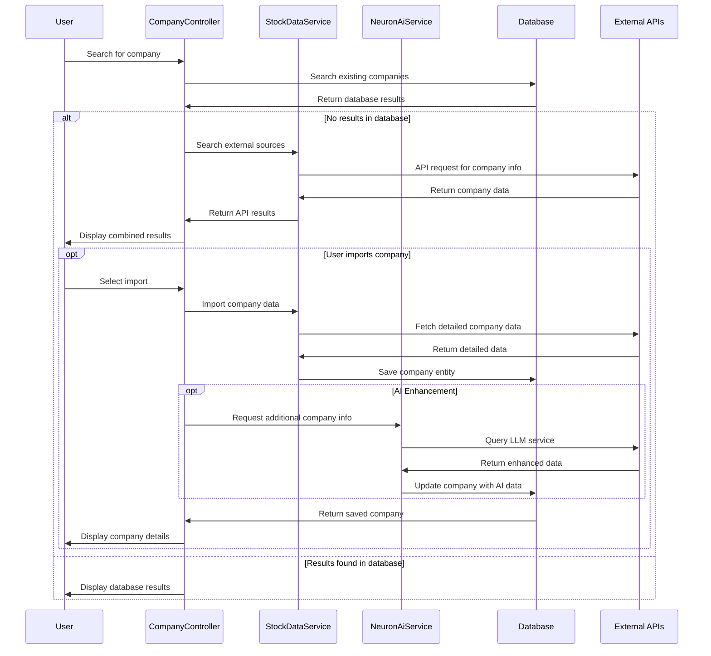

# Neuron AI + Symfony Company Research Application Architecture

This document outlines the architecture of the Neuron AI + Symfony Company Research Application, a web application that leverages Symfony framework and Neuron AI to provide comprehensive company research capabilities.

## Table of Contents

- [System Overview](#system-overview)
- [Architectural Patterns](#architectural-patterns)
- [Component Architecture](#component-architecture)
- [Data Flow](#data-flow)
- [Technology Stack](#technology-stack)
- [Integration Architecture](#integration-architecture)
- [Deployment Architecture](#deployment-architecture)
- [Security Considerations](#security-considerations)
- [References & Resources](#references--resources)

## System Overview

The Company Research Application is a web application that enables users to:

- Search and research companies by name, industry, or keyword
- Import company data from financial data sources
- Gather and analyze financial data (quarterly reports, 10K)
- Identify and profile company leadership
- Generate competitive analyses
- Provide industry segment analysis
- Export reports to PDF or Excel

The system leverages Neuron AI to automate data gathering, analysis, and report generation, making it faster and more efficient to perform comprehensive company research.

## Architectural Patterns

The application follows these architectural patterns:

1. **Model-View-Controller (MVC)** - Implemented through Symfony's framework pattern
2. **Service-Oriented Architecture** - Business logic encapsulated in service classes
3. **Repository Pattern** - Data access through Doctrine ORM repositories
4. **Client-Server Architecture** - Web application serving HTML/JS clients
5. **Cloud-Native Design** - Built for deployment to Cloud Foundry with service binding support
6. **Dependency Injection** - Symfony's DI container for service management
7. **Event-Driven Components** - For handling certain application events
8. **Command Query Responsibility Segregation (CQRS)** - For financial data operations

## Component Architecture


### Main Components

1. **Web UI Layer**
   - Symfony Twig templates
   - Bootstrap framework for styling
   - JavaScript for asynchronous requests
   - Form handling for user inputs
   - Dynamic data display

2. **Controller Layer**
   - Route handling and request processing
   - Input validation
   - Response generation
   - Session management
   - Error handling

3. **Service Layer**
   - Business logic implementation
   - Integration with external services
   - Data transformation and manipulation
   - Background processing

4. **Repository Layer**
   - Data access abstractions
   - Query building and execution
   - Entity management
   - Data persistence

5. **Entity Layer**
   - Domain models and object-relational mapping
   - Business rules and validation
   - Relationships between entities

6. **Neuron AI Integration**
   - GenAI service client
   - Prompt engineering and response parsing
   - Context management for AI requests
   - Error recovery and fallback mechanisms

7. **External API Integration**
   - Financial data providers
   - Stock market information
   - News and press releases
   - Company profiles and information
   - SEC filings and reports

## Data Flow

### Company Search and Import Flow



### Financial Analysis Flow


### Report Generation Flow


## Technology Stack

### Backend

- **Symfony 6.3+**: PHP web application framework
- **PHP 8.3+**: Programming language
- **Doctrine ORM**: Object-relational mapping for database interactions
- **Neuron AI SDK**: PHP library for LLM interactions
- **Twig**: Template engine for views
- **Symfony Messenger**: For asynchronous processing
- **Symfony Security**: For authentication and authorization
- **Symfony Form**: For form handling and validation
- **Symfony Validator**: For data validation
- **MySQL/PostgreSQL/SQLite**: Database options

### Frontend

- **HTML/CSS/JavaScript**: Standard web technologies
- **Bootstrap 5**: CSS framework for responsive design
- **Chart.js**: For financial data visualization
- **Fetch API**: For asynchronous requests
- **FontAwesome**: Icon library

### External Services

- **LLM API**: Configurable LLM endpoint (compatible with OpenAI API)
- **Financial Data APIs**: Stock market and company data
- **SEC Filing APIs**: For regulatory filing information
- **News APIs**: For company news and press releases

### DevOps & Deployment

- **Cloud Foundry**: Platform for deployment
- **Symfony Env**: Environment variable management
- **Composer**: Dependency management
- **Git**: Version control
- **GitHub Actions**: CI/CD pipeline

## Integration Architecture

### LLM Integration

The application integrates with Large Language Model (LLM) services through a GenAI adapter:

```php
// NeuronAiService class excerpt
public function __construct(
    private string $apiKey,
    private string $baseUrl = null,
    private string $model = 'gpt-4o-mini'
) {
    // Initialize the service with credentials
}

public function generateCompanyInfo(string $companyName): array
{
    $prompt = $this->buildCompanyInfoPrompt($companyName);

    try {
        $response = $this->callLlmApi($prompt);
        return $this->parseCompanyInfoResponse($response);
    } catch (\Exception $e) {
        return ['error' => 'Failed to generate company information: ' . $e->getMessage()];
    }
}
```

### Financial Data Integration

The application uses financial data APIs to fetch real-time and historical company data:

```php
// StockDataService class excerpt
public function getCompanyNews(string $symbol, int $limit = 10): array
{
    try {
        $response = $this->apiClient->get("/company/news/{$symbol}", [
            'query' => ['limit' => $limit]
        ]);

        return $this->processNewsResponse($response);
    } catch (\Exception $e) {
        $this->logger->error('Failed to fetch company news', [
            'symbol' => $symbol,
            'error' => $e->getMessage()
        ]);

        return [];
    }
}
```

### Service Binding Architecture

When deployed to Cloud Foundry, the application can automatically bind to LLM services:

```php
// Service configuration example
if (isset($_ENV['VCAP_SERVICES'])) {
    $vcapServices = json_decode($_ENV['VCAP_SERVICES'], true);

    // Look for GenAI service binding
    if (isset($vcapServices['genai'])) {
        $genaiService = $vcapServices['genai'][0];
        $apiKey = $genaiService['credentials']['api_key'] ?? null;
        $baseUrl = $genaiService['credentials']['base_url'] ?? null;
        $model = $genaiService['credentials']['model'] ?? 'gpt-4o-mini';

        // Configure the NeuronAiService with these credentials
    }
}
```

## Deployment Architecture

The application is designed for deployment to Tanzu Platform for Cloud Foundry:


The application uses the following deployment strategy:

1. **Application Code**: PHP Symfony application deployed as a Cloud Foundry app
2. **Database**: Bound database service (MySQL, PostgreSQL, or SQLite)
3. **LLM Service**: Bound GenAI service for AI capabilities
4. **Environment Variables**: Configuration via environment variables
5. **Service Discovery**: Automatic discovery of bound services
6. **Scaling**: Horizontal scaling via instance count

## Security Considerations

### Authentication & Authorization

- Form-based authentication for users
- Role-based access control for different user types
- Session management with secure cookies
- CSRF protection for form submissions

### Data Protection

- API keys stored in environment variables
- Sensitive data encrypted in the database
- No hardcoded credentials in source code
- Proper input validation and sanitization

### API Security

- Rate limiting for external API calls
- Secure communication over HTTPS
- Proper error handling to prevent information leakage
- API key rotation mechanisms

### Cloud Foundry Security

- Secure service binding for credentials
- Network isolation between applications
- Security groups for outbound access control
- Encrypted communication between components

## References & Resources

### Core Technologies

- [Symfony Documentation](https://symfony.com/doc/current/index.html)
- [Doctrine ORM Documentation](https://www.doctrine-project.org/projects/doctrine-orm/en/current/index.html)
- [PHP 8.3 Documentation](https://www.php.net/docs.php)

### Deployment

- [Cloud Foundry Documentation](https://docs.cloudfoundry.org/)
- [Tanzu Platform Documentation](https://docs.vmware.com/en/VMware-Tanzu-Application-Platform/index.html)
- [PHP Buildpack Documentation](https://docs.cloudfoundry.org/buildpacks/php/index.html)

### API References

- [Neuron AI Documentation](https://github.com/neuron-ai/docs)
- [Financial Data API Documentation](https://example.com/financial-api-docs)
- [SEC EDGAR API Documentation](https://www.sec.gov/edgar/sec-api-documentation)
