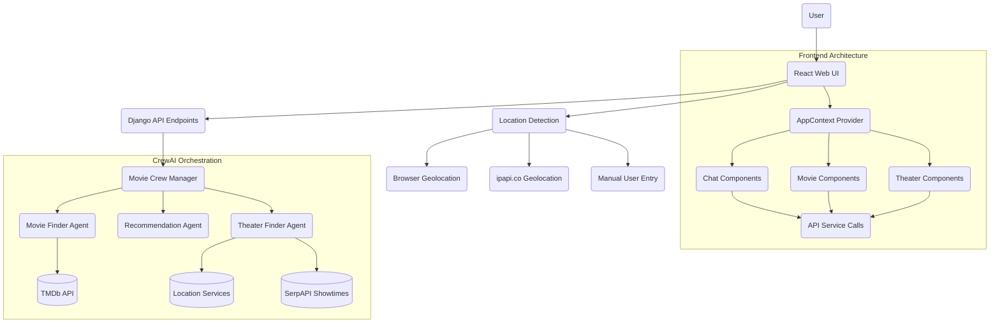

# CrewAI + Django Movie Chatbot

 

This example demonstrates a movie chatbot built with Django and CrewAI that can be deployed to Tanzu Platform for Cloud Foundry and integrate with LLM services through the GenAI tile.

## Features

- Modern React frontend with optimized component architecture
- Conversational interface to find movies based on interests or topics
- Two conversation modes:
  - **First Run Mode**: Find movies currently in theaters with showtimes
  - **Casual Viewing Mode**: Discover movies from any time period
- Recommends top 3 movie choices based on user preferences
- Shows nearby theaters where movies are playing with available showtimes
- Uses CrewAI to coordinate multiple AI agents working together
- Responsive web interface with real-time UI feedback
- Automatic location detection with multiple fallback mechanisms
- Flexible deployment to Cloud Foundry with GenAI tile integration

## Architecture

The application demonstrates an advanced multi-agent AI architecture with a React-based frontend:



The application consists of:

1. **Modern Frontend Architecture**:
   - React-based UI using functional components and hooks
   - Context API for state management
   - React Query for data fetching and caching
   - Suspense and lazy loading for performance optimization
   - Component-based architecture for maintainability
   - Responsive design for all devices

2. **Django Backend Framework**:
   - RESTful API endpoints for chat interactions
   - Session management for conversation tracking
   - Database models for conversation history and recommendations
   - Asynchronous processing for theater and showtime data

3. **CrewAI Integration**:
   - Orchestrates specialized AI agents working together to process requests
   - **Movie Finder Agent**: Searches for movies matching user criteria using TMDb API
   - **Recommendation Agent**: Analyzes and ranks movie choices based on user preferences
   - **Theater Finder Agent**: Finds nearby theaters and real-time showtimes

4. **Service Binding**:
   - Connects to LLM services provided by the GenAI tile through a standard interface
   - Automatic configuration based on environment

## Prerequisites

- Python 3.12+ and pip
- Node.js 18+ and npm
- Cloud Foundry CLI (for deployment)
- Access to Tanzu Platform for Cloud Foundry with GenAI tile installed
- API keys for external services:
  - An OpenAI-compatible LLM API key (when running locally without GenAI tile)
  - TMDB API key (sign-up for a free account [here](https://www.themoviedb.org/signup))
  - SerpAPI key (sign-up for a free account [here](https://serpapi.com/users/sign_up))

## Local Development

1. Clone the repository:

   ```bash
   git clone https://github.com/cf-toolsuite/tanzu-genai-showcase
   cd tanzu-genai-showcase/py-django-crewai
   ```

2. Create and activate a virtual environment:

   ```bash
   python -m venv venv
   source venv/bin/activate  # On Windows, use: venv\Scripts\activate
   ```

3. Install backend dependencies:

   ```bash
   pip install -r requirements.txt
   ```

4. Install frontend dependencies:

   ```bash
   cd frontend
   npm install
   cd ..
   ```

5. Create a `.env` file with your API keys and configuration options (for local development only):

   ```bash
   # Django secret
   DJANGO_SECRET_KEY=any_old_django_hash

   # Required API keys
   OPENAI_API_KEY=your_llm_api_key_here
   LLM_BASE_URL=optional_custom_endpoint
   LLM_MODEL=gpt-4o-mini
   TMDB_API_KEY=your_movie_db_api_key_here
   SERPAPI_API_KEY=optional_serpapi_key_for_real_showtimes

   # Optional configuration parameters
   MOVIE_RESULTS_LIMIT=5            # Number of movie results to return from search
   MAX_RECOMMENDATIONS=3            # Maximum number of recommended movies to show
   THEATER_SEARCH_RADIUS_MILES=15   # Radius in miles to search for theaters
   DEFAULT_SEARCH_START_YEAR=1900   # Default start year for historical movie searches

   # Optional API request configuration
   API_REQUEST_TIMEOUT_SECONDS=180  # Maximum seconds to wait for API responses
   API_MAX_RETRIES=10               # Maximum number of retry attempts for failed API requests
   API_RETRY_BACKOFF_FACTOR=1.3     # Exponential backoff factor between retries (in seconds)

   # Optional SerpAPI request configuration
   SERPAPI_REQUEST_BASE_DELAY=5.0   # Base delay between theater requests for different movies (seconds)
   SERPAPI_PER_MOVIE_DELAY=2.0      # Additional delay per movie processed (seconds)
   SERPAPI_MAX_RETRIES=2            # Maximum retries for SerpAPI requests
   SERPAPI_BASE_RETRY_DELAY=3.0     # Base delay for exponential backoff during retries (seconds)
   SERPAPI_RETRY_MULTIPLIER=1.5     # Multiplier for exponential backoff during retries
   ```

6. Build the frontend:

   ```bash
   cd frontend
   npm run build
   cd ..
   ```

7. Run migrations:

   ```bash
   python manage.py makemigrations chatbot
   python manage.py migrate
   ```

8. Start the development server:

   ```bash
   python manage.py runserver
   ```

9. Open your browser to `http://localhost:8000`

10. For frontend development with hot reloading:

    ```bash
    cd frontend
    npm start
    ```

    This will start a development server at `http://localhost:8080` that proxies API requests to the Django backend.

## Testing Both Conversation Modes

The application offers two distinct conversation modes:

- **First Run Mode**: Default tab for finding movies currently in theaters with showtimes
  - This mode uses all three agents (Movie Finder, Recommender, Theater Finder)
  - Shows theaters and showtimes for current movies
  - Uses geolocation to find nearby theaters

- **Casual Viewing Mode**: Switch to this tab for historical movie recommendations
  - This mode uses two agents (Movie Finder, Recommender)
  - Allows exploration of movies from any time period
  - No theater information (focuses on recommendations only)

Each mode maintains its own conversation history and movie recommendations for a streamlined user experience.

## Building for Production

1. Switch to frontend directory

   ```bash
   cd frontend
   ```

2. Set up .env file as described in Local Development instructions.

3. Ensure webpack and Django are installed.

   ```bash
   npm install --save-dev clean-webpack-plugin
   pip3 install Django
   ```

4. Create a production-ready build:

   ```bash
   cd frontend
   npm run build
   cd ..
   python manage.py collectstatic --noinput
   ```

5. Set up database:

   - For local testing, SQLite is fine
   - For production, configure a PostgreSQL database via DATABASE_URL

## Deploying to Tanzu Platform for Cloud Foundry

### Additional Prerequisites

- Cloud Foundry CLI installed and configured
- Access to a Tanzu Platform for Cloud Foundry environment
- GenAI tile installed in the target environment

### Deployment Steps

1. Login to your Cloud Foundry instance:

   ```bash
   cf login -a API_ENDPOINT -o YOUR_ORG -s YOUR_SPACE
   ```

2. Deploy the application:

   ```bash
   # You have two options:

   # 1. Download dependencies during build phase
   cf push --no-start

   # Or

   # 2. Download dependencies in advance into vendor directory
   ./deploy-on-tp4cf.sh
   ```

3. Bind to a GenAI service instance:

   ```bash
   # Discover available GenAI tile service offering plans
   cf marketplace -e genai

   # Create a GenAI service instance
   cf create-service genai PLAN_NAME movie-chatbot-llm

   # Bind the application to the service
   cf bind-service movie-chatbot movie-chatbot-llm
   ```

   > [!IMPORTANT]
   > Replace `PLAN_NAME` above with an available plan from the GenAI tile service offering

4. Add hash and service API keys

   ```bash
   cf set-env movie-chatbot DJANGO_SECRET_KEY any_old_django_hash
   cf set-env movie-chatbot TMDB_API_KEY your_movie_db_api_key
   cf set-env movie-chatbot SERPAPI_API_KEY your_serpapi_key_for_real_showtimes
   ```

   > [!IMPORTANT]
   > Replace the hash and API key values above with authorized key values from each service. For `DJANGO_SECRET_KEY`, this can be any value, it's used for hashing purposes.

5. Start application

   ```bash
   cf start movie-chatbot
   ```

6. Verify the deployment:

   ```bash
   cf apps
   cf routes
   ```

## Service Binding Details

The application automatically integrates with the GenAI tile through service binding:

### How Service Binding Works

1. **Automatic Detection**:

   - When deployed to Cloud Foundry, the application automatically detects the `VCAP_SERVICES` environment variables
   - These variables contain the bound service instances and their credentials

2. **Credential Extraction**:

   - The application parses the `VCAP_SERVICES` to extract LLM service credentials
   - It looks for services labeled 'genai' or named 'movie-chatbot-llm'
   - It extracts the API key, base URL, and model name

3. **Fallback Mechanism**:

   - If no bound services are found, the application falls back to environment variables
   - This allows for flexibility in different deployment scenarios

4. **CrewAI Configuration**:

   - The extracted credentials are used to configure the CrewAI agents
   - Agents are initialized with the appropriate LLM service configuration
   - This allows the agents to make API calls to the LLM service

## Frontend Architecture

The frontend is built with modern React practices:

1. **Component Structure**:
   - Organized by feature (Chat, Movies, Theaters)
   - Lazy-loaded components for performance
   - Suspense for loading states

2. **State Management**:
   - React Context API for shared state
   - React Query for API state
   - Localized state where appropriate

3. **API Integration**:
   - Centralized API service
   - Error handling and retry logic
   - Response caching for improved performance

4. **User Experience**:
   - Progress indicators for long-running operations
   - Responsive design for all devices
   - Informative error messages with retry options

## Troubleshooting

### Common Issues

1. **Missing API Keys**:
   - Ensure you've set up all required API keys in your `.env` file for local development
   - For Cloud Foundry deployments, verify your service binding is correct

2. **Location Detection Issues**:
   - The application requires a US location for theater information
   - If automatic location detection fails, you can manually enter a US city and state
   - Check browser console for geolocation errors

3. **Movie Recommendations Not Showing**:
   - Verify your TMDb API key is valid
   - Check network requests in browser dev tools to see API responses
   - Look for specific error messages in the server logs

4. **Theater Data Not Appearing**:
   - Theater data is only shown for current release movies
   - Theater search is US-only (limited by SerpAPI capabilities)
   - Check that location is correctly detected or entered

5. **LLM Service Connection Issues**:
   - Verify API key and endpoint configuration
   - Check service binding in Cloud Foundry (cf services)
   - Try restaging the application after binding (cf restage app-name)

### Debug Logging

To enable debug logging:

1. For local development, add to your `.env` file:

   ```bash
   DEBUG=True
   LOG_LEVEL=DEBUG
   ```

2. For Cloud Foundry, set environment variables:

   ```bash
   cf set-env movie-chatbot DEBUG True
   cf set-env movie-chatbot LOG_LEVEL DEBUG
   cf restage movie-chatbot
   ```

3. View logs:

   ```bash
   cf logs movie-chatbot --recent
   ```

## Resources

* [CrewAI Documentation](https://docs.crewai.com/)
* [Django Documentation](https://docs.djangoproject.com/)
* [React Documentation](https://react.dev/)
* [Cloud Foundry Documentation](https://docs.cloudfoundry.org/)
* [The Movie Database Developer Documentation](https://developer.themoviedb.org/docs/getting-started)
* [SerpAPI Showtimes Documentation](https://serpapi.com/showtimes-results)
* [ipapi.co Documentation](https://ipapi.co/api/)

* [Architecture Guide](./docs/ARCHITECTURE.md)
* [Configuration Guide](./docs/CONFIGURATION.md)
* [Developer Guide](./docs/DEVELOPMENT.md)
* [Troubleshooting Guide](./docs/TROUBLESHOOTING.md)
* [Deployment Guide](DEPLOY.md)
   * [Cloud Foundry Deployment Guide](./docs/CLOUD_FOUNDRY.md)
   * [Scenarios Guide](./docs/DEPLOYMENT_SCENARIOS.md)
* [API Documentation](./docs/API.md)
* [Testing Guide](./docs/TESTING.md)
* [Contributing](./docs/CONTRIBUTING.md)
