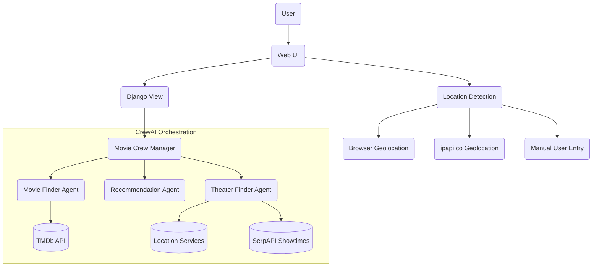

# CrewAI + Django Movie Chatbot

 

This example demonstrates a movie booking chatbot built with Django and CrewAI that can be deployed to Tanzu Platform for Cloud Foundry and integrate with LLM services through the GenAI tile.

## Features

- Conversational interface to find movies based on interests or topics
- Two conversation modes:
  - **First Run Mode**: Find movies currently in theaters with showtimes
  - **Casual Viewing Mode**: Discover movies from any time period
- Recommends top 3 movie choices based on user preferences
- Shows nearby theaters where movies are playing with available showtimes
- Uses CrewAI to coordinate multiple AI agents working together
- Responsive Django web interface with real-time UI feedback
- Automatic location detection with multiple fallback mechanisms
- Flexible deployment to Cloud Foundry with GenAI tile integration

## Architecture

The application demonstrates an advanced multi-agent AI architecture:



The application consists of:

1. **Django Web Framework**: Handles HTTP requests, user sessions, and renders the UI
2. **CrewAI Integration**: Orchestrates specialized AI agents working together to process requests
3. **Multiple Agent System**:
   - **Movie Finder Agent**: Searches for movies matching user criteria using TMDb API
   - **Recommendation Agent**: Analyzes and ranks movie choices based on user preferences
   - **Theater Finder Agent**: Finds nearby theaters and real-time showtimes
4. **Service Binding**: Connects to LLM services provided by the GenAI tile through a standard interface

## Prerequisites

- Python 3.10+ and pip
- Cloud Foundry CLI (for deployment)
- Access to Tanzu Platform for Cloud Foundry with GenAI tile installed
- API keys for external services:
  - An OpenAI-compatible LLM API key (when running locally without GenAI tile)
  - TMDB API key (sign-up for a free account [here](https://www.themoviedb.org/signup))
  - SerpAPI key (sign-up for a free account [here](https://serpapi.com/users/sign_up))

## Local Development

1. Clone the repository:

   ```bash
   git clone https://github.com/cf-toolsuite/tanzu-genai-showcase
   cd tanzu-genai-showcase/py-django-crewai
   ```

2. Create and activate a virtual environment:

   ```bash
   python -m venv venv
   source venv/bin/activate  # On Windows, use: venv\Scripts\activate
   ```

3. Install dependencies:

   ```bash
   pip install -r requirements.txt
   ```

4. Create a `.env` file with your API keys and configuration options (for local development only):

   ```bash
   # Django secret
   DJANGO_SECRET_KEY=any_old_django_secret

   # Required API keys
   OPENAI_API_KEY=your_llm_api_key_here
   LLM_BASE_URL=optional_custom_endpoint
   LLM_MODEL=gpt-4o-mini
   TMDB_API_KEY=your_movie_db_api_key_here
   SERPAPI_API_KEY=optional_serpapi_key_for_real_showtimes

   # Optional configuration parameters
   MOVIE_RESULTS_LIMIT=5            # Number of movie results to return from search
   MAX_RECOMMENDATIONS=3            # Maximum number of recommended movies to show
   THEATER_SEARCH_RADIUS_MILES=15   # Radius in miles to search for theaters
   DEFAULT_SEARCH_START_YEAR=1900   # Default start year for historical movie searches

   # Optional API request configuration
   API_REQUEST_TIMEOUT_SECONDS=10   # Maximum seconds to wait for API responses
   API_MAX_RETRIES=3                # Maximum number of retry attempts for failed API requests
   API_RETRY_BACKOFF_FACTOR=0.5     # Exponential backoff factor between retries (in seconds)
   ```

5. Run migrations:

   ```bash
   python manage.py makemigrations chatbot
   python manage.py migrate
   ```

6. Start the development server:

   ```bash
   python manage.py runserver
   ```

7. Open your browser to `http://localhost:8000`

8. Testing both modes:

   - **First Run Mode**: Default tab for finding movies currently in theaters
   - **Casual Viewing Mode**: Switch to this tab for historical movie recommendations

## Building for Production

1. Create a production-ready build:

   ```bash
   python manage.py collectstatic --noinput
   ```

2. Set up database:

   - For local testing, SQLite is fine
   - For production, configure a PostgreSQL database via DATABASE_URL

## Deploying to Tanzu Platform for Cloud Foundry

### Additional Prerequisites

- Cloud Foundry CLI installed and configured
- Access to a Tanzu Platform for Cloud Foundry environment
- GenAI tile installed in the target environment

### Deployment Steps

1. Login to your Cloud Foundry instance:

   ```bash
   cf login -a API_ENDPOINT -o YOUR_ORG -s YOUR_SPACE
   ```

2. Deploy the application:

   ```bash
   cf push --no-start
   ```

3. Bind to a GenAI service instance:

   ```bash
   # Create a GenAI service instance
   cf create-service genai PLAN_NAME movie-chatbot-llm

   # Bind the application to the service
   cf bind-service movie-chatbot movie-chatbot-llm

   # Start the application
   cf start movie-chatbot
   ```

4. Verify the deployment:

   ```bash
   cf apps
   cf routes
   ```

## Service Binding Details

The application automatically integrates with the GenAI tile through service binding:

### How Service Binding Works

1. **Automatic Detection**:

   - When deployed to Cloud Foundry, the application automatically detects the `VCAP_SERVICES` environment variables
   - These variables contain the bound service instances and their credentials

2. **Credential Extraction**:

   - The application parses the `VCAP_SERVICES` to extract LLM service credentials
   - It looks for services labeled 'genai' or named 'movie-chatbot-llm'
   - It extracts the API key, base URL, and model name

3. **Fallback Mechanism**:

   - If no bound services are found, the application falls back to environment variables
   - This allows for flexibility in different deployment scenarios

4. **CrewAI Configuration**:

   - The extracted credentials are used to configure the CrewAI agents
   - Agents are initialized with the appropriate LLM service configuration
   - This allows the agents to make API calls to the LLM service

### Service Binding Code Example

```python
def get_llm_config():
    # Check if running in Cloud Foundry with bound services
    if cf_env.get_service(label='genai') or cf_env.get_service(name='movie-chatbot-llm'):
        service = cf_env.get_service(label='genai') or cf_env.get_service(name='movie-chatbot-llm')
        credentials = service.credentials

        return {
            'api_key': credentials.get('api_key') or credentials.get('apiKey'),
            'base_url': credentials.get('url') or credentials.get('baseUrl'),
            'model': credentials.get('model') or 'gpt-4o-mini'
        }

    # Fallback to environment variables for local development
    return {
        'api_key': os.getenv('OPENAI_API_KEY'),
        'base_url': os.getenv('LLM_BASE_URL'),
        'model': os.getenv('LLM_MODEL', 'gpt-4o-mini')
    }
```

## Troubleshooting

### Common Issues

1. **Missing API Keys**:
   - Ensure you've set up all required API keys in your `.env` file for local development
   - For Cloud Foundry deployments, verify your service binding is correct

2. **Location Detection Issues**:
   - The application requires a US location for theater information
   - If automatic location detection fails, you can manually enter a US city and state
   - Check browser console for geolocation errors

3. **Movie Recommendations Not Showing**:
   - Verify your TMDb API key is valid
   - Check network requests in browser dev tools to see API responses
   - Look for specific error messages in the server logs

4. **Theater Data Not Appearing**:
   - Theater data is only shown for current release movies
   - Theater search is US-only (limited by SerpAPI capabilities)
   - Check that location is correctly detected or entered

5. **LLM Service Connection Issues**:
   - Verify API key and endpoint configuration
   - Check service binding in Cloud Foundry (cf services)
   - Try restaging the application after binding (cf restage app-name)

### Debug Logging

To enable debug logging:

1. For local development, add to your `.env` file:

   ```bash
   DEBUG=True
   LOG_LEVEL=DEBUG
   ```

2. For Cloud Foundry, set environment variables:

   ```bash
   cf set-env movie-chatbot DEBUG True
   cf set-env movie-chatbot LOG_LEVEL DEBUG
   cf restage movie-chatbot
   ```

3. View logs:

   ```bash
   cf logs movie-chatbot --recent
   ```

## Resources

- [CrewAI Documentation](https://docs.crewai.com/)
- [Django Documentation](https://docs.djangoproject.com/)
- [Cloud Foundry Documentation](https://docs.cloudfoundry.org/)
- [The Movie Database Developer Documentation](https://developer.themoviedb.org/docs/getting-started)
- [SerpAPI Showtimes Documentation](https://serpapi.com/showtimes-results)
- [ipapi.co Documentation](https://ipapi.co/api/)

- [Architecture Guide](./docs/ARCHITECTURE.md)
- [Developer Guide](./docs/DEVELOPMENT.md)
- [Troubleshooting Guide](./docs/TROUBLESHOOTING.md)
- [Deployment Guide](./docs/DEPLOYMENT-SCENARIOS.md)
- [Contributing](./docs/CONTRIBUTING.md)
