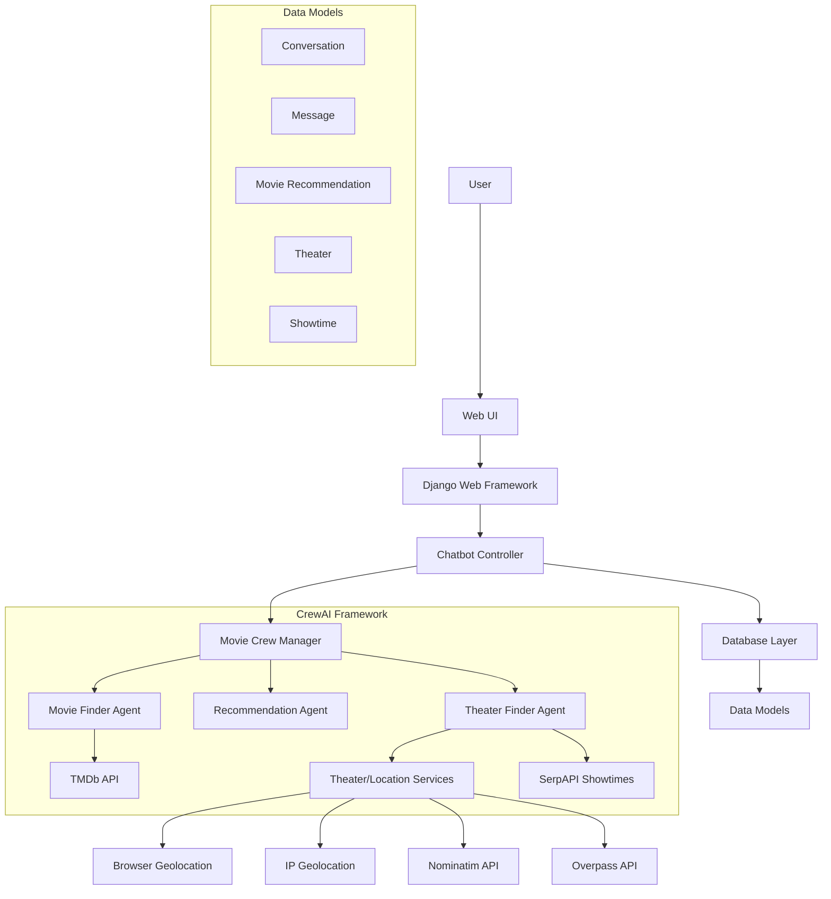
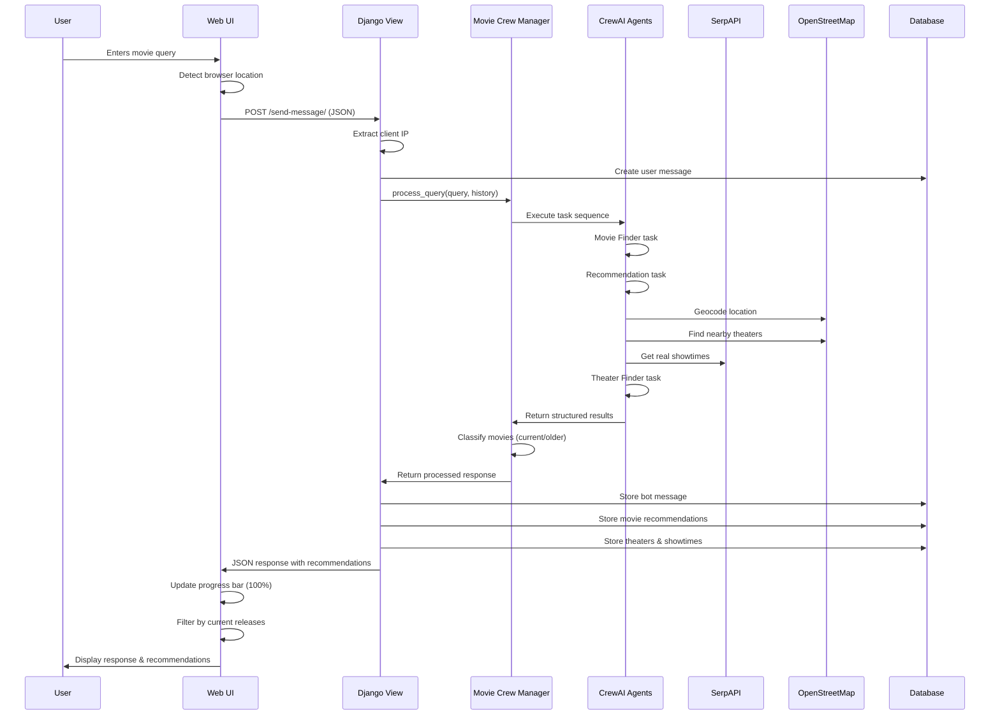
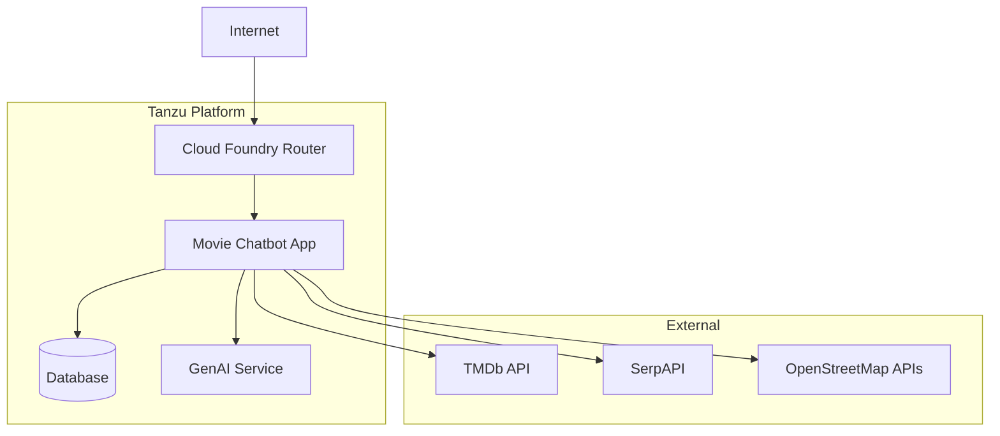

# Movie Booking Chatbot Architecture

This document outlines the architecture of the Movie Booking Chatbot application, a Django-based web application that utilizes CrewAI for intelligent movie recommendations and theater information.

## Table of Contents

- [System Overview](#system-overview)
- [Architectural Patterns](#architectural-patterns)
- [Component Architecture](#component-architecture)
- [Data Flow](#data-flow)
- [Technology Stack](#technology-stack)
- [Integration Architecture](#integration-architecture)
- [Deployment Architecture](#deployment-architecture)
- [Error Handling & Resilience](#error-handling--resilience)
- [Security Considerations](#security-considerations)
- [References & Resources](#references--resources)

## System Overview

The Movie Booking Chatbot is a web application that enables users to interact with an AI-powered chatbot to:

- Find movies based on their interests and preferences
- Get movie recommendations with detailed information
- Find nearby theaters showing those movies
- View available showtimes

The system leverages multiple AI agents coordinated through CrewAI to process natural language queries, search for movie information, make recommendations, and find relevant theater and showtime data.

## Architectural Patterns

The application follows these architectural patterns:

1. **Model-View-Controller (MVC)** - Implemented through Django's MTV (Model-Template-View) pattern
2. **Microagent Architecture** - Using CrewAI to coordinate multiple specialized AI agents
3. **Service-Oriented Architecture** - Integration with external APIs via service adapters
4. **Repository Pattern** - Data access through Django's ORM
5. **Cloud-Native Design** - Built for deployment to Cloud Foundry with service binding support

## Component Architecture



### Main Components

1. **Web UI Layer**
   - Django templates with Bootstrap styling
   - JavaScript for asynchronous chat interactions
   - AJAX for handling requests without page refresh
   - Interactive progress feedback with contextual messages
   - Automatic browser location detection

2. **Django Application**
   - URL routing and request handling
   - Session management
   - CSRF protection
   - Template rendering
   - IP detection for geolocation services

3. **Chatbot Controller**
   - Manages conversation state
   - Processes user input
   - Delegates natural language processing to CrewAI
   - Formats responses for the UI

4. **Movie Crew Manager**
   - Coordinates AI agents via CrewAI
   - Processes query results
   - Handles error cases
   - Formats structured data
   - Classifies movies as current releases or older movies

5. **CrewAI Agents**
   - **Movie Finder Agent**: Searches for movies based on user preferences
   - **Recommendation Agent**: Ranks and selects the best movie options
   - **Theater Finder Agent**: Locates theaters and showtimes for recommended movies

6. **CrewAI Tools**
   - **SearchMoviesTool**: Pydantic-based tool for searching TMDb movies
   - **AnalyzePreferencesTool**: Tool for analyzing movie preferences
   - **FindTheatersTool**: Tool for finding theaters showing recommended movies

7. **Geolocation Services**
   - **Browser Geolocation**: Uses browser's navigator.geolocation API
   - **IP-based Geolocation**: Fallback using IPInfo.io
   - **Nominatim**: OpenStreetMap geocoding service
   - **Overpass API**: OpenStreetMap query service for finding theaters

8. **External Service Integrations**
   - **The Movie Database (TMDb) API**: Movie information and metadata
   - **SerpAPI Google Showtimes**: Real-time movie showtimes data
   - **OpenStreetMap APIs**: Location data and services

9. **Database Layer**
   - Conversation persistence
   - Message history
   - Movie recommendations
   - Theater and showtime information

## Data Flow

### Conversation Flow



### Data Processing Flow

1. **User Input & Location Detection**
   - User sends a text message via the chat interface
   - Browser attempts to get user's geolocation
   - Frontend validates and sends to backend via AJAX

2. **Request Processing**
   - Django view extracts the message, location, and client IP address
   - Conversation and message are stored in the database
   - Message is passed to the Movie Crew Manager

3. **AI Agent Orchestration**
   - The Movie Crew Manager initializes the appropriate LLM
   - CrewAI tasks are executed in sequence:
     1. Movie Finder Agent searches for relevant movies
     2. Recommendation Agent selects and ranks the best options
     3. Theater Finder Agent locates theaters and showtimes
   - Each agent has specialized tools for its specific tasks
   - The CrewOutput object is processed to extract results from each agent

4. **Location & Theater Processing**
   - User location is determined through:
     - Explicitly provided location text
     - Browser geolocation (if allowed)
     - IP-based geolocation (fallback)
     - Default location (when all else fails)
   - Geocoding converts location to coordinates
   - OpenStreetMap Overpass API finds real theaters
   - SerpAPI provides real-time movie showtimes

5. **Movie Classification & Processing**
   - Movies are classified as current or older releases
   - Current releases: Movies from current year or previous year
   - Older releases: Movies more than one year old
   - Only current releases are shown with theater information
   - Both types appear in chat responses

6. **Response Generation**
   - Results from agents are parsed and validated
   - A natural language response is generated
   - Structured data (movies, theaters, showtimes) is prepared

7. **Data Persistence**
   - Bot message is stored in the database
   - Movie recommendations are stored
   - Theater and showtime information is linked to recommendations

8. **Response Delivery**
   - JSON response is sent back to the frontend
   - UI updates progress bar to 100% and hides it
   - UI filters recommendations to show only current movies with theaters
   - UI displays the bot message and recommendations
   - Showtimes are formatted in 24-hour format

## Technology Stack

### Backend

- **Django 5.2**: Web framework for handling HTTP requests, routing, and templating
- **CrewAI 0.114.0**: Framework for coordinating multiple AI agents
- **LangChain 0.3.22**: Framework for LLM application development
- **LangChain-OpenAI 0.3.12**: OpenAI integration for LangChain
- **Pydantic 2.11.2**: Data validation and settings management
- **TMDbSimple 2.9.1**: Python wrapper for The Movie Database API
- **Google-Search-Results 2.4.2**: SerpAPI client for real showtimes
- **Geopy 2.4.1**: Geocoding and distance calculations
- **Requests 2.31.0**: HTTP client for API interactions
- **WhiteNoise 6.9.0**: Static file serving for production
- **Gunicorn 23.0.0**: WSGI HTTP server for production deployment
- **SQLite/PostgreSQL**: Database (configurable via DATABASE_URL)

### Frontend

- **HTML/CSS/JavaScript**: Standard web technologies
- **Bootstrap 5.3.0**: CSS framework for responsive design
- **Bootstrap Icons 1.11.3**: Icon library
- **Fetch API**: For asynchronous requests
- **Browser Geolocation API**: For user location detection

### External Services

- **LLM API**: Configurable LLM endpoint (compatible with OpenAI API)
- **TMDb API**: The Movie Database for movie information
- **SerpAPI Google Showtimes**: Real movie showtime data
- **OpenStreetMap APIs**:
  - **Nominatim**: Geocoding service
  - **Overpass API**: Theater location data
  - **Reverse Geocoding**: Converting coordinates to addresses

### DevOps & Deployment

- **Cloud Foundry**: Platform for deployment
- **cfenv 0.5.3**: Library for Cloud Foundry environment parsing
- **python-dotenv 1.1.0**: Environment variable management
- **dj-database-url 2.3.0**: Database URL configuration

## Integration Architecture

### LLM Integration

The application is designed to integrate with any LLM service that provides an OpenAI-compatible API. It supports:

1. **Cloud Foundry Service Binding**: Automatically detects and uses credentials from bound GenAI services
2. **Manual Configuration**: Supports custom API keys and endpoints via environment variables
3. **Model Selection**: Configurable LLM model (default: gpt-4o-mini)

```python
# LLM Configuration from settings.py
def get_llm_config():
    # Check if running in Cloud Foundry with bound services
    if cf_env.get_service(label='genai') or cf_env.get_service(name='my-llm-service'):
        service = cf_env.get_service(label='genai') or cf_env.get_service(name='my-llm-service')
        credentials = service.credentials

        return {
            'api_key': credentials.get('api_key') or credentials.get('apiKey'),
            'base_url': credentials.get('url') or credentials.get('baseUrl'),
            'model': credentials.get('model') or 'gpt-4o-mini'
        }

    # Fallback to environment variables for local development
    return {
        'api_key': os.getenv('OPENAI_API_KEY'),
        'base_url': os.getenv('LLM_BASE_URL'),
        'model': os.getenv('LLM_MODEL', 'gpt-4o-mini')
    }
```

### TMDb API Integration

The application uses TMDbSimple to interact with The Movie Database API for movie information:

- Movie search functionality
- Detailed movie information
- Now playing movies
- Movie credits and genres

API Reference: [The Movie Database API](https://developer.themoviedb.org/docs)

### SerpAPI Integration

The application uses SerpAPI to fetch real movie showtime data:

```python
class SerpShowtimeService:
    """Service for fetching movie showtimes using SerpAPI."""

    def __init__(self, api_key: str):
        """Initialize the SerpAPI service."""
        self.api_key = api_key

    def search_showtimes(self, movie_title: str, location: str, radius_miles: int = 20):
        """Search for movie showtimes for a specific movie in a location."""
        # Construct parameters for SerpAPI
        params = {
            "engine": "google_showtimes",
            "q": movie_title,
            "location": location,
            "hl": "en",
            "gl": "us",
            "api_key": self.api_key
        }

        # Execute the search
        search = GoogleSearch(params)
        results = search.get_dict()

        # Process and format the results
        theaters = self._parse_serp_results(results, movie_title)
        return theaters
```

### Geolocation Services

The application uses multiple approaches to determine user location:

1. **Browser Geolocation**

   ```javascript
   if (navigator.geolocation) {
       navigator.geolocation.getCurrentPosition(
           function(position) {
               const latitude = position.coords.latitude;
               const longitude = position.coords.longitude;

               // Use reverse geocoding to get readable location
               fetch(`https://nominatim.openstreetmap.org/reverse?format=json&lat=${latitude}&lon=${longitude}`)
                   .then(response => response.json())
                   .then(data => {
                       const locationName = data.display_name;
                       locationInput.value = locationName;
                   });
           }
       );
   }
   ```

2. **IP-based Geolocation (Server-side)**

   ```python
   def get_location_from_ip(self, ip_address: str):
       """Get user location from IP address."""
       response = requests.get(f"https://ipinfo.io/{ip_address}/json")

       if response.status_code == 200:
           data = response.json()
           if 'loc' in data:
               lat, lon = data['loc'].split(',')
               city = data.get('city', '')
               region = data.get('region', '')
               country = data.get('country', '')

               return {
                   "latitude": float(lat),
                   "longitude": float(lon),
                   "display_name": f"{city}, {region}, {country}"
               }
   ```

3. **Theater Search with OpenStreetMap**

   ```python
   def search_theaters(self, latitude: float, longitude: float, radius_miles: float = 20):
       """Search for movie theaters within a specified radius."""
       # Convert radius to meters for API
       radius_meters = radius_miles * 1609.34

       # Build Overpass API query for movie theaters
       overpass_query = f"""
       [out:json];
       (
           node["amenity"="cinema"](around:{radius_meters},{latitude},{longitude});
           way["amenity"="cinema"](around:{radius_meters},{latitude},{longitude});
           relation["amenity"="cinema"](around:{radius_meters},{latitude},{longitude});
       );
       out center;
       """

       # Execute query and process results
       response = requests.post("https://overpass-api.de/api/interpreter", data=overpass_query)
       data = response.json()

       # Process theaters...
   ```

## Deployment Architecture

The application is designed for deployment to Tanzu Platform for Cloud Foundry:



### Deployment Process

1. **Preparation**
   - Configure environment variables or create `.env` file
   - Collect static files: `python manage.py collectstatic --noinput`

2. **Cloud Foundry Deployment**
   - CF Push using manifest.yml
   - Bind to a GenAI service instance
   - Bind to a database service (if needed)
   - Restage the application

3. **Configuration**
   - The application auto-detects Cloud Foundry environment
   - Service credentials are automatically extracted from VCAP_SERVICES
   - Database connection is configured via DATABASE_URL

## Error Handling & Resilience

The application implements several error handling and resilience patterns:

1. **Location Detection Resilience**
   - Multiple fallback mechanisms for location detection:
     - Browser geolocation (primary)
     - User-provided location
     - IP-based geolocation
     - Default location (last resort)

2. **Showtime Service Resilience**
   - SerpAPI integration with fallback to generated showtimes
   - Theater validation to ensure theaters show relevant movies
   - Time zone handling for correct showtime display

3. **Movie Classification System**
   - Current vs. older release detection
   - Conditional UI rendering based on movie type

4. **API Response Validation**
   - All external API responses are validated before processing
   - Default values provided for missing or invalid data

5. **JSON Parsing with Error Recovery**
   - Robust JSON parsing with fallback mechanisms
   - Support for extracting JSON from text responses

6. **Exception Boundary Pattern**
   - Top-level exception handling in Django views
   - Graceful error responses to users

7. **Fallback Responses**
   - Default responses when AI services fail
   - Helpful error messages that maintain conversation flow

8. **Extensive Logging**
   - Detailed logging with contextual information
   - Log levels appropriate for different environments
   - Structured logging format for easier debugging

## Security Considerations

1. **API Key Protection**
   - API keys stored in environment variables
   - No hardcoded credentials in source code

2. **Web Security**
   - CSRF protection for form submissions
   - Content-Security-Policy headers
   - XSS prevention in templates

3. **Input Validation**
   - All user input validated before processing
   - Safe handling of JSON data

4. **Service Binding Security**
   - Secure credential handling from bound services
   - Automatic management of service credentials

5. **Geolocation Privacy**
   - Browser geolocation requires user consent
   - IP geolocation as fallback only

## References & Resources

### Core Technologies

- [Django](https://docs.djangoproject.com/)
- [CrewAI](https://docs.crewai.com/)
- [LangChain](https://python.langchain.com/docs/get_started/introduction)
- [TMDb API](https://developer.themoviedb.org/docs/getting-started)
- [SerpAPI](https://serpapi.com/showtimes-results)
- [OpenStreetMap API](https://wiki.openstreetmap.org/wiki/API)
- [Overpass API](https://wiki.openstreetmap.org/wiki/Overpass_API)
- [Nominatim API](https://nominatim.org/release-docs/latest/api/Overview/)
- [IPInfo.io](https://ipinfo.io/developers)

### Cloud Foundry

- [Cloud Foundry](https://docs.cloudfoundry.org/)
- [Tanzu Platform](https://docs.vmware.com/en/VMware-Tanzu-Application-Platform/index.html)
- [GenAI Tile](https://docs.vmware.com/en/VMware-Tanzu-Application-Platform/1.5/tap/services-genai.html)

### Design Patterns

- [CrewAI Patterns](https://github.com/joaomdmoura/crewAI/tree/main/docs/examples)
- [LangChain Chain Patterns](https://python.langchain.com/docs/modules/chains/)
- [Django Design Patterns](https://djangopatterns.readthedocs.io/en/latest/)
