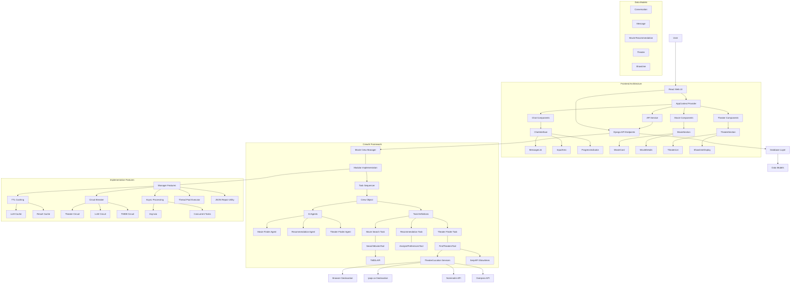
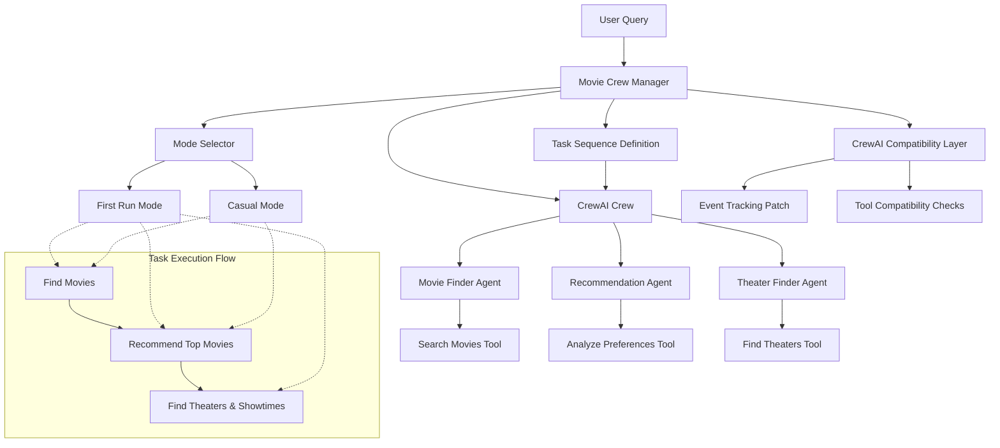

# Movie Chatbot Architecture

This document outlines the architecture of the Movie Chatbot application, a Django and React-based web application that utilizes CrewAI for intelligent movie recommendations and theater information.

## Table of Contents

- [System Overview](#system-overview)
- [Architectural Patterns](#architectural-patterns)
- [Component Architecture](#component-architecture)
- [Data Flow](#data-flow)
- [Technology Stack](#technology-stack)
- [Frontend Architecture](#frontend-architecture)
- [Backend Architecture](#backend-architecture)
- [Agent Orchestration](#agent-orchestration)
- [Integration Architecture](#integration-architecture)
- [Deployment Architecture](#deployment-architecture)
- [Error Handling & Resilience](#error-handling--resilience)
- [Security Considerations](#security-considerations)
- [References & Resources](#references--resources)

## System Overview

The Movie Chatbot is a web application that enables users to interact with an AI-powered chatbot to:

- Find movies based on their interests and preferences
- Get movie recommendations with detailed information
- Find nearby theaters showing those movies
- View available showtimes

The system provides two primary modes:

- **First Run Mode**: Focused on current movies playing in theaters with real showtimes
- **Casual Viewing Mode**: For exploring movies from any time period without theater information

The system leverages CrewAI to coordinate multiple AI agents working together, processing natural language queries, searching for movie information, making recommendations, and finding relevant theater and showtime data. The frontend is built with React to provide a modern, responsive user experience.

## Architectural Patterns

The application follows these architectural patterns:

1. **Model-View-Controller (MVC)** - Backend implemented through Django's MTV (Model-Template-View) pattern
2. **Component-Based Architecture** - Frontend built with React functional components and hooks
3. **Context Provider Pattern** - React context for state management
4. **Microagent Architecture** - Using CrewAI to coordinate multiple specialized AI agents
5. **Service-Oriented Architecture** - Integration with external APIs via service adapters
6. **Repository Pattern** - Data access through Django's ORM
7. **Cloud-Native Design** - Built for deployment to Cloud Foundry with service binding support
8. **Feature Toggle Pattern** - Support for two distinct conversation modes (First Run/Casual Viewing)
9. **Graceful Degradation** - Multiple fallback mechanisms for location detection and theater data
10. **RESTful API Pattern** - Backend communication through RESTful endpoints

## Component Architecture



### Main Components

1. **React Frontend Layer**
   - Functional components with hooks
   - React Context for state management
   - React Query for data fetching and caching
   - Suspense and lazy loading for performance
   - Feature-organized component structure (Chat, Movies, Theaters)
   - AJAX for asynchronous communication with backend
   - Progressive loading feedback with state tracking
   - Responsive design with Bootstrap
   - Polling pattern for long-running operations

2. **Django Backend Layer**
   - RESTful API endpoints for chat interactions
   - Session management for multiple conversations
   - CSRF protection
   - JSON response handling
   - Error handling and logging
   - Environment detection (Cloud Foundry vs. local)
   - Status tracking for long-running operations

3. **Chatbot Controller**
   - API endpoints for processing chat messages
   - Mode-specific request handling (First Run vs. Casual)
   - User session management
   - Conversation history tracking
   - CrewAI integration and orchestration
   - Polling endpoints for long-running operations
   - Status tracking for multi-phase operations

4. **Movie Crew Manager**
   - **Optimized Enhanced Implementation**: High-performance version with caching and parallel processing
   - Coordinates AI agents via CrewAI
   - Processes query results with error recovery
   - Handles agent communication failures
   - Formats structured data
   - Classifies movies as current releases or older movies
   - Manages mode-specific behavior (First Run vs. Casual Viewing)
   - Implements circuit breaker pattern for external APIs
   - Uses TTL caching for LLM instances and results
   - Processes theater data in parallel with thread pools
   - Implements advanced JSON repair strategies

5. **CrewAI Agents**
   - **Movie Finder Agent**: Searches for movies based on user preferences
     - Handles genre detection, decade filtering, and keyword extraction
     - Prioritizes current releases for First Run mode
     - Performs historical searches for Casual Viewing mode
   - **Recommendation Agent**: Ranks and selects the best movie options
     - Analyzes user preferences against movie features
     - Provides justifications for each recommendation
     - Considers recency, popularity, and genre relevance
   - **Theater Finder Agent**: Locates theaters and showtimes for recommended movies
     - Integrates geolocation data
     - Searches for real theaters near the user
     - Retrieves and formats showtime information
     - Uses optimized implementation for parallel processing

6. **Optimization Components**:
   - **TTL Cache System**: Time-based caching with automatic expiration
     - LLM instance caching to avoid recreation
     - Result caching for theaters and recommendations
     - Automatic cleanup of expired cache entries
   - **Circuit Breaker Pattern**: Prevents cascading failures from external API issues
     - Separate circuit breakers for theater, LLM, and TMDb services
     - Failure threshold configuration
     - Self-healing with recovery timeout
     - Half-open state for gradual recovery
   - **Asynchronous Processing**: Parallel execution of tasks
     - ThreadPoolExecutor for CPU-bound operations
     - Asyncio for I/O-bound operations
     - Task coordination with Future objects
     - Timeout handling for long-running operations
   - **JSON Repair Utilities**: Robust parsing of potentially malformed JSON
     - Multiple repair strategies (regex-based fixes, structure analysis)
     - Fallback mechanisms for invalid JSON
     - Auto-correction of common JSON syntax issues

6. **CrewAI Tools**
   - **SearchMoviesTool**: Pydantic-based tool for searching TMDb movies
     - Supports different search strategies based on conversation mode
     - Handles advanced filters like decades and genres
     - Enhanced image quality selection
   - **AnalyzePreferencesTool**: Tool for analyzing movie preferences
     - Extracts user preferences from natural language
     - Manages preference weighting and scoring
   - **FindTheatersTool**: Tool for finding theaters showing recommended movies
     - Integrates with geolocation services
     - Processes and validates theater data
     - Formats showtimes with timezone adjustment

7. **Geolocation Services**
   - **Browser Geolocation**: Uses browser's navigator.geolocation API
     - Requires user consent
     - Provides high accuracy when available
   - **ipapi.co Geolocation**: Free IP-based geolocation service
     - Used for automatic location detection
     - Provides city, state, and timezone information
     - US-location validation and formatting
   - **Nominatim**: OpenStreetMap geocoding service
     - Converts location text to coordinates
     - Provides reverse geocoding for user-friendly display
   - **Overpass API**: OpenStreetMap query service for finding theaters
     - Finds real theaters based on amenity tags
     - Supports radius-based searches

8. **External Service Integrations**
   - **The Movie Database (TMDb) API**: Movie information and metadata
     - Current releases and historical movie data
     - Enhanced image quality selection
     - Detailed movie information (cast, genres, ratings)
   - **SerpAPI Google Showtimes**: Real-time movie showtimes data
     - Theater information for current movies
     - Structured showtimes with formats (IMAX, 3D, etc.)
   - **OpenStreetMap APIs**: Location data and services
     - Geocoding and reverse geocoding
     - Theater location data
   - **ipapi.co API**: IP-based geolocation
     - City, state, country information
     - Timezone detection
     - US location validation

9. **Database Layer**
   - Conversation persistence with mode tracking
   - Message history
   - Movie recommendations with metadata
   - Theater and showtime information
   - Location caching

## Data Flow

### Conversation Flow


### Data Processing Flow

1. **User Input & Mode Selection**
   - User selects conversation mode (First Run or Casual Viewing) via tab interface
   - User enters a text query in the selected mode's input field
   - If in First Run mode, browser attempts to get user's geolocation
   - React frontend validates and sends data to backend via API service

2. **Request Processing**
   - Django view identifies the appropriate conversation based on mode
   - Message content, location, and client IP address are extracted
   - Conversation and message are stored in the database
   - Message and mode flag are passed to the Movie Crew Manager

3. **AI Agent Orchestration**
   - The Movie Crew Manager initializes the appropriate LLM
   - Different tasks are configured based on the conversation mode
   - CrewAI tasks are executed in sequence:
     1. Movie Finder Agent searches for relevant movies
        - In First Run mode: prioritizes current theatrical releases
        - In Casual Viewing mode: searches any time period
     2. Recommendation Agent selects and ranks the best options
     3. Theater Finder Agent locates theaters and showtimes (First Run mode only)
   - Each agent has specialized tools for its specific tasks
   - The CrewOutput object is processed to extract results from each agent

4. **Location & Theater Processing (First Run Mode)**
   - User location is determined through multi-level fallback:
     1. Explicitly provided location text (user entry)
     2. Browser geolocation API (requires permission)
     3. ipapi.co IP-based geolocation (automatic)
     4. Default location (when all else fails)
   - US-based validation ensures theater data compatibility
   - Geocoding converts location to coordinates
   - OpenStreetMap Overpass API finds real theaters near coordinates
   - SerpAPI provides real-time movie showtimes

5. **Movie Classification & Processing**
   - Movies are classified as current or older releases
   - Current releases: Movies from current year or previous year
   - Older releases: Movies more than one year old
   - Only current releases are shown with theater information
   - In First Run mode, current releases are prioritized
   - In Casual Viewing mode, all matching movies are shown

6. **Response Generation**
   - Results from agents are parsed and validated with error recovery
   - A natural language response is generated
   - Structured data (movies, theaters, showtimes) is prepared
   - Mode-specific formatting is applied

7. **Data Persistence**
   - Bot message is stored in the database
   - Movie recommendations are stored with metadata
   - Theater and showtime information is linked to recommendations (First Run mode)

8. **Response Delivery**
   - JSON response is sent back to the frontend
   - React Context updates state with the new data
   - React components re-render with the updated state
   - In First Run mode:
     - MovieSection component displays current movies
     - TheaterSection component shows theaters and showtimes
   - In Casual Viewing mode:
     - MovieSection component displays historical movies
   - ChatInterface component displays the conversation history

## Technology Stack

### Backend

- **Django 5.2**: Web framework for handling HTTP requests, routing, and API endpoints
- **CrewAI 0.114.0**: Framework for coordinating multiple AI agents
- **LangChain 0.3.22**: Framework for LLM application development
- **LangChain-OpenAI 0.3.12**: OpenAI integration for LangChain
- **Pydantic 2.11.2**: Data validation and settings management
- **TMDbSimple 2.9.1**: Python wrapper for The Movie Database API
- **Google-Search-Results 2.4.2**: SerpAPI client for real showtimes
- **Geopy 2.4.1**: Geocoding and distance calculations
- **Requests 2.31.0**: HTTP client for API interactions
- **WhiteNoise 6.9.0**: Static file serving for production
- **Gunicorn 23.0.0**: WSGI HTTP server for production deployment
- **SQLite/PostgreSQL**: Database (configurable via DATABASE_URL)

### Frontend

- **React 18**: JavaScript library for building user interfaces
- **React Query**: Data fetching and state management library
- **React Context API**: State management across components
- **React Suspense**: Loading state management
- **Bootstrap 5.3.0**: CSS framework for responsive design
- **Bootstrap Icons 1.11.3**: Icon library
- **Webpack**: Module bundler for JavaScript applications
- **Babel**: JavaScript compiler for modern JavaScript features
- **Fetch API**: For asynchronous requests
- **Browser Geolocation API**: For user location detection

### External Services

- **LLM API**: Configurable LLM endpoint (compatible with OpenAI API)
- **TMDb API**: The Movie Database for movie information
- **SerpAPI Google Showtimes**: Real movie showtime data
- **ipapi.co API**: IP-based geolocation and timezone detection
- **OpenStreetMap APIs**:
  - **Nominatim**: Geocoding service
  - **Overpass API**: Theater location data
  - **Reverse Geocoding**: Converting coordinates to addresses

### DevOps & Deployment

- **Cloud Foundry**: Platform for deployment
- **cfenv 0.5.3**: Library for Cloud Foundry environment parsing
- **python-dotenv 1.1.0**: Environment variable management
- **dj-database-url 2.3.0**: Database URL configuration

## Frontend Architecture

The frontend is built with modern React practices, focusing on component reusability, performance optimization, and maintainable code structure.

### Component Organization

The React components are organized by feature:

```
frontend/
├── src/
│   ├── components/
│   │   ├── Chat/
│   │   │   ├── ChatInterface.jsx
│   │   │   ├── MessageList.jsx
│   │   │   ├── MessageItem.jsx
│   │   │   ├── InputArea.jsx
│   │   │   └── LazyChatInterface.jsx
│   │   ├── Movies/
│   │   │   ├── MovieSection.jsx
│   │   │   ├── MovieCard.jsx
│   │   │   ├── MovieDetails.jsx
│   │   │   └── MoviePlaceholder.jsx
│   │   └── Theaters/
│   │       ├── TheaterSection.jsx
│   │       ├── TheaterList.jsx
│   │       ├── ShowtimeDisplay.jsx
│   │       └── LazyTheaterSection.jsx
│   ├── context/
│   │   └── AppContext.jsx
│   ├── hooks/
│   │   ├── useChat.js
│   │   ├── useLocation.js
│   │   └── useMovies.js
│   ├── services/
│   │   └── api.js
│   ├── styles/
│   │   ├── app.css
│   │   └── skeleton.css
│   ├── App.jsx
│   └── index.js
```

### State Management

The application uses React Context API for state management:

```jsx
// AppContext.jsx
import React, { createContext, useContext, useState, useEffect } from 'react';

const AppContext = createContext();

export const useAppContext = () => useContext(AppContext);

export const AppProvider = ({ children }) => {
  // Tab state
  const [activeTab, setActiveTab] = useState('first-run');

  // First Run mode state
  const [firstRunMessages, setFirstRunMessages] = useState([]);
  const [firstRunMovies, setFirstRunMovies] = useState([]);
  const [firstRunTheaters, setFirstRunTheaters] = useState([]);
  const [selectedMovieId, setSelectedMovieId] = useState(null);

  // Casual Viewing mode state
  const [casualMessages, setCasualMessages] = useState([]);
  const [casualMovies, setCasualMovies] = useState([]);

  // Shared state
  const [isLoading, setIsLoading] = useState(false);
  const [location, setLocation] = useState('');

  // Function to switch between tabs
  const switchTab = (tab) => {
    setActiveTab(tab);
    setSelectedMovieId(null);
  };

  // Function to select a movie
  const selectMovie = (id) => {
    setSelectedMovieId(id);
  };

  // Context value
  const value = {
    activeTab,
    switchTab,
    firstRunMessages,
    setFirstRunMessages,
    firstRunMovies,
    setFirstRunMovies,
    firstRunTheaters,
    setFirstRunTheaters,
    casualMessages,
    setCasualMessages,
    casualMovies,
    setCasualMovies,
    isLoading,
    setIsLoading,
    location,
    setLocation,
    selectedMovieId,
    selectMovie
  };

  return (
    <AppContext.Provider value={value}>
      {children}
    </AppContext.Provider>
  );
};
```

### Performance Optimization

The application uses several techniques to optimize performance:

1. **Lazy Loading**: Components are loaded only when needed

   ```jsx
   // Lazy loading example
   const ChatInterface = React.lazy(() => import('./components/Chat/LazyChatInterface'));
   const MovieSection = React.lazy(() => import('./components/Movies/MovieSection'));
   const TheaterSection = React.lazy(() => import('./components/Theaters/LazyTheaterSection'));
   ```

2. **Suspense**: Provides fallback content while components are loading

   ```jsx
   <Suspense fallback={<LoadingFallback />}>
     <ChatInterface />
   </Suspense>
   ```

3. **React Query**: Optimizes data fetching with caching and background updates

   ```jsx
   const queryClient = new QueryClient({
     defaultOptions: {
       queries: {
         refetchOnWindowFocus: false,
         staleTime: 5 * 60 * 1000, // 5 minutes
       },
     },
   });
   ```

4. **Conditional Rendering**: Components render only when data is available

   ```jsx
   {movies.length > 0 ? (
     <MovieSection movies={movies} />
   ) : (
     <MoviePlaceholder />
   )}
   ```

### API Integration

The frontend communicates with the backend through a centralized API service:

```jsx
// api.js
import axios from 'axios';

// Create an axios instance with CSRF token handling
const api = axios.create({
  headers: {
    'Content-Type': 'application/json',
  },
  // Add timeout to prevent hanging requests
  timeout: 30000, // 30 seconds
});

// Add CSRF token to requests
api.interceptors.request.use(config => {
  const csrfToken = getCookie('csrftoken');
  if (csrfToken) {
    config.headers['X-CSRFToken'] = csrfToken;
  }
  return config;
});

// API service functions
export const chatApi = {
  getMoviesTheatersAndShowtimes: async (message, location = '') => {
    try {
      console.log(`[First Run Mode] Getting movies, theaters, and showtimes for: "${message}" (Location: ${location})`);

      const response = await api.post('/get-movies-theaters-and-showtimes/', {
        message: message,
        location,
        timezone: Intl.DateTimeFormat().resolvedOptions().timeZone,
        mode: 'first_run' // Explicitly set mode to first_run
      });

      if (!response.data || response.data.status !== 'success') {
        throw new Error(response.data?.message || 'Failed to get movies and theaters');
      }

      return response.data;
    } catch (error) {
      console.error('Error getting movies and theaters:', error);
      throw error;
    }
  },

  getMovieRecommendations: async (message) => {
    try {
      console.log(`[Casual Mode] Getting movie recommendations for: "${message}"`);

      const response = await api.post('/get-movie-recommendations/', {
        message: message,
        timezone: Intl.DateTimeFormat().resolvedOptions().timeZone,
        mode: 'casual' // Explicitly set mode to casual
      });

      if (!response.data || response.data.status !== 'success') {
        throw new Error(response.data?.message || 'Failed to get movie recommendations');
      }

      return response.data;
    } catch (error) {
      console.error('Error getting movie recommendations:', error);
      throw error;
    }
  }
};
```

## Backend Architecture

The backend is built with Django, providing RESTful API endpoints for the React frontend.

### API Endpoints

```python
# urls.py
from django.urls import path
from . import views

urlpatterns = [
    path('get-movies-theaters-and-showtimes/', views.first_run_message, name='first_run_message'),
    path('get-movie-recommendations/', views.casual_message, name='casual_message'),
    path('get-theaters/<int:movie_id>/', views.get_theaters, name='get_theaters'),
    path('theater-status/<int:movie_id>/', views.theater_status, name='theater_status'),
    path('reset/', views.reset_conversations, name='reset_conversations'),
    path('health/', views.health_check, name='health_check'),
]
```

### View Implementation

```python
# views.py
@csrf_exempt
def first_run_message(request):
    """Process a message in the First Run conversation mode."""
    if request.method != 'POST':
        return JsonResponse({
            'status': 'error',
            'message': 'This endpoint only accepts POST requests'
        }, status=405)

    try:
        data = _parse_request_data(request)
        message_text = data.get('message', '').strip()
        location = data.get('location', '').strip()
        client_ip = _get_client_ip(request)

        # Get or create First Run conversation
        conversation = _get_or_create_conversation(request, 'first_run')

        # Create user message
        user_message = Message.objects.create(
            conversation=conversation,
            content=message_text,
            sender='user'
        )

        # Process the message with CrewAI
        crew_manager = _get_crew_manager(location, client_ip)

        # Get conversation history
        history = _get_conversation_history(conversation)

        # Process query with First Run mode
        result = crew_manager.process_query(message_text, history, first_run_mode=True)

        # Create bot message
        bot_message = Message.objects.create(
            conversation=conversation,
            content=result['response'],
            sender='bot'
        )

        # Store movie recommendations
        _store_movie_recommendations(conversation, result['movies'])

        return JsonResponse({
            'status': 'success',
            'message': result['response'],
            'recommendations': result['movies']
        })
    except Exception as e:
        logger.error(f"Error in first_run_message: {str(e)}")
        return JsonResponse({
            'status': 'error',
            'message': 'An error occurred while processing your message'
        }, status=500)
```

### Movie Crew Manager

The Movie Crew Manager is the core component that orchestrates the AI agents:

```python
class MovieCrewManager:
    """Manager for the movie recommendation crew."""

    def __init__(
        self,
        api_key: str,
        base_url: Optional[str] = None,
        model: str = "gpt-4o-mini",
        tmdb_api_key: Optional[str] = None,
        user_location: Optional[str] = None,
        user_ip: Optional[str] = None,
        timezone: Optional[str] = None,
        llm_provider: Optional[str] = None
    ):
        """Initialize the MovieCrewManager."""
        self.api_key = api_key
        self.base_url = base_url
        self.model = model
        self.tmdb_api_key = tmdb_api_key
        self.user_location = user_location
        self.user_ip = user_ip
        self.timezone = timezone
        self.llm_provider = llm_provider

        # Configure TMDb API if key is provided
        if tmdb_api_key:
            tmdb.API_KEY = tmdb_api_key

    def process_query(self, query: str, conversation_history: List[Dict[str, str]], first_run_mode: bool = True) -> Dict[str, Any]:
        """Process a user query and return movie recommendations."""
        # Create the LLM
        llm = self.create_llm()

        # Create the agents
        movie_finder = MovieFinderAgent.create(llm)
        recommender = RecommendationAgent.create(llm)
        theater_finder = TheaterFinderAgent.create(llm)

        # Create tools for each task, passing the mode
        search_tool = SearchMoviesTool()
        search_tool.first_run_mode = first_run_mode
        analyze_tool = AnalyzePreferencesTool()
        theater_finder_tool = FindTheatersTool(user_location=self.user_location)

        # Create the tasks
        find_movies_task = Task(
            description=f"Find movies that match the user's criteria: '{query}'",
            expected_output="A JSON list of relevant movies with title, overview, release date, and TMDb ID",
            agent=movie_finder,
            tools=[search_tool]
        )

        recommend_movies_task = Task(
            description=f"Recommend the top {max_recommendations} movies from the list that best match the user's preferences",
            expected_output=f"A JSON list of the top {max_recommendations} recommended movies with explanations",
            agent=recommender,
            tools=[analyze_tool]
        )

        find_theaters_task = Task(
            description="Find theaters showing the recommended movies near the user's location",
            expected_output="A JSON list of theaters showing the recommended movies with showtimes",
            agent=theater_finder,
            tools=[theater_finder_tool]
        )

        # Create the crew based on the mode
        if first_run_mode:
            # For First Run mode (theater-based recommendations), include all agents and tasks
            crew = Crew(
                agents=[movie_finder, recommender, theater_finder],
                tasks=[find_movies_task, recommend_movies_task, find_theaters_task],
                verbose=True
            )
        else:
            # For Casual Viewing mode, skip the theater finder
            crew = Crew(
                agents=[movie_finder, recommender],
                tasks=[find_movies_task, recommend_movies_task],
                verbose=True
            )

        # Execute the crew
        result = crew.kickoff()

        # Process the results
        # ... (processing logic)

        return {
            "response": response_message,
            "movies": movies_with_theaters
        }
```

## Agent Orchestration

The application uses CrewAI to implement a multiple-agent system, where each agent has a specialized role. This section details how these agents work together.

### CrewAI Implementation



### Agent Definitions

Agents are defined using CrewAI's agent architecture, with specific roles, goals, and backstories:

```python
# Movie Finder Agent
movie_finder = Agent(
    role="Movie Finder",
    goal="Find movies that match the user's criteria",
    backstory="""You are an expert movie finder who knows everything about movies. Your job is to help users
              find movies that match their preferences, including genre, actors, directors, themes, and more.
              You use The Movie Database API to find the most relevant movies based on user queries.""",
    verbose=True,
    llm=llm
)

# Recommendation Agent
recommender = Agent(
    role="Movie Recommender",
    goal="Recommend the best movies based on user preferences",
    backstory="""You are an expert movie critic with deep knowledge of cinema. Your job is to analyze
              movie options and recommend the best ones based on user preferences. You consider factors
              like genre match, ratings, popularity, and thematic elements to make personalized recommendations.""",
    verbose=True,
    llm=llm
)

# Theater Finder Agent
theater_finder = Agent(
    role="Theater Finder",
    goal="Find theaters showing the recommended movies near the user",
    backstory="""You are an expert at finding movie theaters and showtimes. Your job is to locate theaters
              showing specific movies near the user's location. You use geolocation services and showtime
              data to provide accurate and up-to-date information about where and when movies are playing.""",
    verbose=True,
    llm=llm
)
```

### Task Definitions

Tasks are dynamically configured based on the conversation mode:

```python
# Create the tasks with the defined tools
find_movies_task = Task(
    description=f"Find movies that match the user's criteria: '{query}'",
    expected_output="A JSON list of relevant movies with title, overview, release date, and TMDb ID",
    agent=movie_finder,
    tools=[search_tool]
)

recommend_movies_task = Task(
    description=f"Recommend the top {max_recommendations} movies from the list that best match the user's preferences",
    expected_output=f"A JSON list of the top {max_recommendations} recommended movies with explanations",
    agent=recommender,
    tools=[analyze_tool]
)

find_theaters_task = Task(
    description="Find theaters showing the recommended movies near the user's location",
    expected_output="A JSON list of theaters showing the recommended movies with showtimes",
    agent=theater_finder,
    tools=[theater_finder_tool]
)
```

### Tool Implementation

Each agent uses specialized Pydantic-based tools:

1. **SearchMoviesTool**:
   - Searches TMDb API with comprehensive filtering
   - Handles decade detection, genre filtering, and current release identification
   - Mode-aware searching (prioritizes current releases in First Run mode)

2. **AnalyzePreferencesTool**:
   - Extracts user preferences from natural language
   - Ranks movies based on preference matching
   - Generates explanations for recommendations

3. **FindTheatersTool**:
   - Integrates location services
   - Searches for real theaters using OpenStreetMap
   - Retrieves showtimes for recommended movies
   - Formats theater and showtime data for display

## CrewAI Integration

The application integrates with CrewAI 0.114.0 and includes specific compatibility fixes and workarounds to ensure stable operation.

### Version Compatibility

The system is specifically designed to work with CrewAI 0.114.0, which requires certain compatibility adjustments:

```python
def _ensure_tool_compatibility(self, tools: List[Any]) -> None:
    """
    Ensure tools have all necessary attributes for CrewAI 0.114.0 compatibility.

    Args:
        tools: List of tools to check and enhance
    """
    for tool in tools:
        try:
            # Make sure the tool has a name attribute
            if not hasattr(tool, 'name'):
                tool_class_name = tool.__class__.__name__
                # Derive a name from the class name if needed
                derived_name = tool_class_name.lower().replace('tool', '_tool')
                setattr(tool, 'name', derived_name)
                logger.info(f"Added missing name '{derived_name}' to tool of type {tool_class_name}")

            # Ensure tool name is registered with CrewAI's event tracking system
            # This prevents the KeyError: 'search_movies_tool' issue
            from crewai.utilities.events.utils.console_formatter import ConsoleFormatter
            if hasattr(ConsoleFormatter, 'tool_usage_counts') and tool.name not in ConsoleFormatter.tool_usage_counts:
                ConsoleFormatter.tool_usage_counts[tool.name] = 0
                logger.info(f"Pre-registered tool '{tool.name}' with CrewAI event tracking")
        except Exception as e:
            logger.warning(f"Error ensuring tool compatibility for {tool.__class__.__name__}: {e}")
```

### Event Tracking Patch

The application includes a custom patch for CrewAI's event tracking system to handle missing tools gracefully:

```python
def _patch_crewai_event_tracking(self):
    """
    Patch CrewAI's event tracking system to handle missing tools gracefully.
    This addresses the KeyError: 'search_movies_tool' issue in newer CrewAI versions.
    """
    try:
        # Import necessary modules from CrewAI
        from crewai.utilities.events.utils.console_formatter import ConsoleFormatter
        from crewai.utilities.events.event_listener import CrewAgentEventListener

        # Store original handle_tool_usage_finished method
        original_handle = ConsoleFormatter.handle_tool_usage_finished

        # Define patched method with error handling
        def patched_handle_tool_usage_finished(self, event):
            try:
                # First try to initialize tool_usage_counts if it doesn't exist
                if not hasattr(self, 'tool_usage_counts'):
                    self.tool_usage_counts = {}

                # Get tool name safely
                tool_name = getattr(event, 'tool_name', 'unknown_tool')

                # Initialize counter for this tool if not already done
                if tool_name not in self.tool_usage_counts:
                    self.tool_usage_counts[tool_name] = 0

                # Now call the original method which should work
                return original_handle(self, event)
            except KeyError as e:
                # Log the error but continue execution
                logger.warning(f"CrewAI event tracking KeyError handled: {e}")
                # Initialize the missing key
                if hasattr(event, 'tool_name'):
                    self.tool_usage_counts[event.tool_name] = 1
                return None
            except Exception as e:
                # Log other errors but don't crash
                logger.error(f"Error in CrewAI event tracking: {e}")
                return None

        # Apply the patch
        ConsoleFormatter.handle_tool_usage_finished = patched_handle_tool_usage_finished
        logger.info("Successfully patched CrewAI event tracking")

    except Exception as e:
        # If patching fails, log but continue
        logger.warning(f"Failed to patch CrewAI event tracking: {e}")
```

### JSON Output Processing

The application includes robust JSON parsing with multiple fallback mechanisms to handle CrewAI's output format variations:

```python
def safe_extract_task_output(task, task_name):
    logger.debug(f"Extracting output from {task_name} task")

    if not hasattr(task, 'output'):
        logger.error(f"{task_name} task has no 'output' attribute")
        return "[]"

    if task.output is None:
        logger.error(f"{task_name} task output is None")
        return "[]"

    # Try different approaches to get the raw output
    if hasattr(task.output, 'raw'):
        output = task.output.raw
        logger.debug(f"Using 'raw' attribute from {task_name} task output")
    elif hasattr(task.output, 'result'):
        output = task.output.result
        logger.debug(f"Using 'result' attribute from {task_name} task output")
    elif hasattr(task.output, 'output'):
        output = task.output.output
        logger.debug(f"Using 'output' attribute from {task_name} task output")
    else:
        output = str(task.output)
        logger.debug(f"Using string conversion for {task_name} task output")

    # Validate output is a string and has content
    if not isinstance(output, str):
        logger.warning(f"{task_name} task output is not a string, converting")
        output = str(output)

    if not output.strip():
        logger.error(f"{task_name} task output is empty after processing")
        return "[]"

    return output
```

## Movie Classification System

The application implements a sophisticated movie classification system to differentiate between current theatrical releases and older movies, which affects how they are displayed and processed.

### Current vs. Older Release Classification

Movies are classified based on their release year relative to the current year:

```python
def _process_current_releases(self, recommendations: List[Dict[str, Any]]) -> None:
    """
    Process recommendations to identify current releases.

    Args:
        recommendations: List of movie recommendations
    """
    # Check which movies are current/first-run vs older movies
    current_year = datetime.now().year
    for movie in recommendations:
        if not isinstance(movie, dict):
            continue

        # Parse release date to determine if it's a current movie
        release_date = movie.get('release_date', '')
        release_year = None
        if release_date and len(release_date) >= 4:
            try:
                release_year = int(release_date[:4])
            except ValueError:
                pass

        # Movies from current year or previous year are considered "current"
        is_current = False
        if release_year and (release_year >= current_year - 1):
            is_current = True

        # Set a flag on each movie
        movie['is_current_release'] = is_current

        # For older movies, set an empty theaters list to prevent showtimes lookup
        if not is_current:
            movie['theaters'] = []
            logger.info(f"Movie '{movie.get('title')}' is an older release ({release_year}), skipping theater lookup")
```

### Mode-Specific Processing

The application uses different search strategies based on the conversation mode:

1. **First Run Mode**: Prioritizes current theatrical releases
   - Searches for movies currently playing in theaters
   - Only shows theater and showtime information for current releases
   - Uses SerpAPI to get real-time showtime data

2. **Casual Viewing Mode**: Allows exploration of movies from any time period
   - Searches for movies from any year
   - Does not show theater or showtime information
   - Supports decade-specific searches

### Decade Detection

The SearchMoviesTool includes sophisticated decade detection for historical movie searches:

```python
# Check for decade or year range in the query
import re
year_ranges = []

# Check for specific decades (90s, 1990s, etc.)
decade_patterns = [
    (r'1990s|90s|nineties', (1990, 1999)),
    (r'1980s|80s|eighties', (1980, 1989)),
    (r'1970s|70s|seventies', (1970, 1979)),
    (r'1960s|60s|sixties', (1960, 1969)),
    (r'1950s|50s|fifties', (1950, 1959)),
    (r'2000s|two thousands', (2000, 2009)),
    (r'2010s|twenty tens', (2010, 2019)),
    (r'2020s|twenty twenties', (2020, 2029))
]

for pattern, (start_year, end_year) in decade_patterns:
    if re.search(fr'\b{pattern}\b', search_query.lower()):
        year_ranges.append((start_year, end_year))
        logger.info(f"Detected decade: {start_year}-{end_year} in query: {search_query}")
```

### Year Range Detection

The application can detect and process various year range formats in user queries:

```python
# Check for year range patterns like "2000-2010" or "between 2000 and 2010"
range_matches = re.findall(r'(\d{4})\s*-\s*(\d{4})', search_query)
if range_matches:
    for start, end in range_matches:
        year_ranges.append((int(start), int(end)))
        logger.info(f"Detected explicit year range: {start}-{end} in query")

# Check for "between X and Y" patterns
between_matches = re.findall(r'between\s+(\d{4})\s+and\s+(\d{4})', search_query.lower())
if between_matches:
    for start, end in between_matches:
        year_ranges.append((int(start), int(end)))
        logger.info(f"Detected 'between' year range: {start}-{end} in query")

# Check for from/before/after year patterns
from_year_match = re.search(r'from\s+(\d{4})', search_query.lower())
if from_year_match:
    year = int(from_year_match.group(1))
    year_ranges.append((year, datetime.now().year))
    logger.info(f"Detected 'from year' pattern: {year}-present in query")
```

### Discover API Integration

For year-specific searches, the application uses TMDb's Discover API to find popular movies from specific time periods:

```python
# If we're in casual mode and have year ranges, try to use the discover API first
if not self.first_run_mode and year_ranges:
    try:
        # Get results limit from the settings
        results_limit = getattr(settings, 'MOVIE_RESULTS_LIMIT', 5)
        logger.info(f"Using discover API for year-specific search in casual mode")

        # Use the discover API directly to get popular movies from the decade
        discover = tmdb.Discover()

        # Use the first detected year range
        start_year, end_year = year_ranges[0]

        # Log the exact years we're searching for
        logger.info(f"Searching for movies released between {start_year} and {end_year}")

        discover_params = {
            "primary_release_date.gte": f"{start_year}-01-01",
            "primary_release_date.lte": f"{end_year}-12-31",
            "sort_by": "vote_average.desc", # Sort by highest rated first
            "vote_count.gte": 100  # Ensure we get well-known movies with sufficient votes
        }

        # Add genres if specified
        if genres:
            discover_params["with_genres"] = ",".join(str(g) for g in genres)

        discover_response = discover.movie(**discover_params)
```

### UI Rendering Based on Classification

The frontend renders different components based on the movie classification:

```jsx
// In First Run mode, show both movies and theaters
if (activeTab === 'first-run') {
  return (
    <>
      <div className="movie-section">
        <h3>Recommended Movies</h3>
        {movies.map(movie => (
          <MovieCard
            key={movie.id}
            movie={movie}
            isSelected={movie.id === selectedMovieId}
            onClick={() => selectMovie(movie.id)}
            isCurrentRelease={movie.is_current_release}
          />
        ))}
      </div>

      {/* Only show theater section for current releases */}
      {selectedMovie && selectedMovie.is_current_release && (
        <TheaterSection
          movie={selectedMovie}
          isLoading={isLoadingTheaters}
        />
      )}
    </>
  );
} else {
  // In Casual Viewing mode, only show movies (no theaters)
  return (
    <div className="movie-section">
      <h3>Recommended Movies</h3>
      {movies.map(movie => (
        <MovieCard
          key={movie.id}
          movie={movie}
          isSelected={movie.id === selectedMovieId}
          onClick={() => selectMovie(movie.id)}
          showReleaseYear={true} // Always show release year in casual mode
    // Update the movie with theaters
    if (response.status === 'success' && response.theaters) {
      console.log(`Found ${response.theaters.length} theaters for movie: ${movie.title}`);
      setFirstRunMovies(prevMovies =>
        prevMovies.map(m =>
          m.id === movieId
            ? { ...m, theaters: response.theaters }
            : m
        )
      );
      setIsLoadingTheaters(false);
    } else if (response.status === 'processing') {
      // If theaters are still being processed, poll for updates
      console.log('Theaters are still being processed, starting polling');
      let attempts = 0;
      const maxAttempts = 5; // Reduced from 10 to 5
      const pollInterval = 2000; // 2 seconds

      const poll = async () => {
        if (attempts >= maxAttempts) {
          console.log('Max polling attempts reached, assuming no theaters available');
          // Instead of showing an error, just set empty theaters array
          setFirstRunMovies(prevMovies =>
            prevMovies.map(m =>
              m.id === movieId
                ? { ...m, theaters: [] }
                : m
            )
          );
          setIsLoadingTheaters(false);
          return;
        }

        attempts++;
        console.log(`Polling attempt ${attempts}/${maxAttempts}`);

        try {
          const pollResponse = await chatApi.pollTheaterStatus(movieId);

          if (pollResponse.status === 'success' && pollResponse.theaters) {
            console.log(`Polling successful, found ${pollResponse.theaters.length} theaters`);
            setFirstRunMovies(prevMovies =>
              prevMovies.map(m =>
                m.id === movieId
                  ? { ...m, theaters: pollResponse.theaters }
                  : m
              )
            );
            setIsLoadingTheaters(false);
            return; // Exit polling once we get results
          } else if (pollResponse.status === 'processing') {
            // Continue polling
            setTimeout(poll, pollInterval);
          } else {
            console.log('Polling returned unexpected status:', pollResponse.status);
            // Instead of showing an error, just set empty theaters array
            setFirstRunMovies(prevMovies =>
              prevMovies.map(m =>
                m.id === movieId
                  ? { ...m, theaters: [] }
                  : m
              )
            );
            setIsLoadingTheaters(false);
          }
        } catch (pollError) {
          console.error('Error while polling for theaters:', pollError);
          // Instead of showing an error, just set empty theaters array
          setFirstRunMovies(prevMovies =>
            prevMovies.map(m =>
              m.id === movieId
                ? { ...m, theaters: [] }
                : m
            )
          );
          setIsLoadingTheaters(false);
        }
      };

      // Start polling
      setTimeout(poll, pollInterval);
    }
  } catch (error) {
    console.error('Error fetching theaters:', error);
    // Error handling...
  }
}, [firstRunMovies]);
```

## LLM Configuration

The application implements a flexible LLM configuration system that supports multiple providers and deployment environments.

### Provider/Model Format

The system supports a provider/model format for specifying LLMs:

```python
def create_llm(self) -> ChatOpenAI:
    """Create the LLM for the agents."""
    # Check if we have a provider specified
    provider = self.llm_provider
    model = self.model

    # If model contains a provider prefix (e.g., "openai/gpt-4o-mini"), extract it
    if model and '/' in model:
        parts = model.split('/', 1)
        if len(parts) == 2:
            provider = parts[0]
            model = parts[1]
            logger.info(f"Extracted provider '{provider}' and model '{model}' from combined format")

    # Create the LLM with the appropriate configuration
    llm = ChatOpenAI(
        api_key=self.api_key,
        base_url=self.base_url,
        model=model,
        temperature=0.7
    )

    return llm
```

### LiteLLM Compatibility

The application supports LiteLLM for model compatibility across different providers:

```python
def _create_litellm_compatible_model(self, provider: str, model: str) -> str:
    """
    Create a LiteLLM-compatible model name from provider and model.

    Args:
        provider: The LLM provider (e.g., "openai", "anthropic", "azure")
        model: The model name (e.g., "gpt-4o-mini", "claude-3-opus")

    Returns:
        LiteLLM-compatible model name
    """
    # Handle special cases for certain providers
    if provider.lower() == "anthropic":
        return f"anthropic/{model}"
    elif provider.lower() == "azure":
        return f"azure/{model}"
    elif provider.lower() == "openai":
        return model  # OpenAI models don't need a prefix in LiteLLM
    else:
        # For other providers, use the format provider/model
        return f"{provider}/{model}"
```

### Environment Variable Configuration

The application supports flexible environment variable configuration:

```python
# settings.py
# LLM Configuration
LLM_CONFIG = get_llm_config()

# Function to get LLM configuration from environment or service bindings
def get_llm_config():
    """Get LLM configuration from environment or service bindings."""
    # Check if running in Cloud Foundry with bound services
    if cf_env.get_service(label='genai') or cf_env.get_service(name='movie-chatbot-llm'):
        service = cf_env.get_service(label='genai') or cf_env.get_service(name='movie-chatbot-llm')
        credentials = service.credentials

        return {
            'api_key': credentials.get('api_key') or credentials.get('apiKey'),
            'base_url': credentials.get('url') or credentials.get('baseUrl'),
            'model': credentials.get('model') or os.getenv('LLM_MODEL', 'gpt-4o-mini'),
            'provider': credentials.get('provider') or os.getenv('LLM_PROVIDER', 'openai')
        }

    # Fallback to environment variables for local development
    return {
        'api_key': os.getenv('OPENAI_API_KEY'),
        'base_url': os.getenv('LLM_BASE_URL'),
        'model': os.getenv('LLM_MODEL', 'gpt-4o-mini'),
        'provider': os.getenv('LLM_PROVIDER', 'openai')
    }
```

### Cloud Foundry Service Binding

The application automatically detects and uses credentials from bound GenAI services:

```python
# Check if running in Cloud Foundry
if os.getenv('VCAP_APPLICATION'):
    logger.info("Running in Cloud Foundry environment")

    # Check for GenAI service binding
    genai_service = cf_env.get_service(label='genai')
    if genai_service:
        logger.info(f"Found GenAI service: {genai_service.name}")
        credentials = genai_service.credentials

        # Extract credentials
        api_key = credentials.get('api_key') or credentials.get('apiKey')
        base_url = credentials.get('url') or credentials.get('baseUrl')
        model = credentials.get('model', os.getenv('LLM_MODEL', 'gpt-4o-mini'))

        logger.info(f"Using model from GenAI service: {model}")
        logger.info(f"Using base URL from GenAI service: {base_url}")
```

### Model Initialization

The application initializes the LLM with appropriate configuration:

```python
def process_query(self, query: str, conversation_history: List[Dict[str, str]], first_run_mode: bool = True) -> Dict[str, Any]:
    """Process a user query and return movie recommendations."""
    # Create the LLM
    llm = self.create_llm()
    logger.info(f"Created LLM with model: {self.model}")

    # Apply CrewAI compatibility patches
    self._patch_crewai_event_tracking()

    # Create the agents
    movie_finder = MovieFinderAgent.create(llm)
    recommender = RecommendationAgent.create(llm)
    theater_finder = TheaterFinderAgent.create(llm)

    # Create tools for each task, passing the mode
    search_tool = SearchMoviesTool()
    search_tool.first_run_mode = first_run_mode
    analyze_tool = AnalyzePreferencesTool()
    theater_finder_tool = FindTheatersTool(user_location=self.user_location)

    # Ensure tool compatibility with CrewAI
    self._ensure_tool_compatibility([search_tool, analyze_tool, theater_finder_tool])
```

## Integration Architecture

### TMDb API Integration

The application uses TMDbSimple to interact with The Movie Database API for movie information:

- Movie search functionality
- Detailed movie information
- Now playing movies
- Movie credits and genres
- Enhanced image quality selection

Code example for searching current movies:

```python
# Check for currently playing movies in TMDB
now_playing = tmdb.Movies()
response = now_playing.now_playing()

if response and 'results' in response and response['results']:
    # Filter by genre if specified
    results = response['results']
    if genres:
        results = [movie for movie in results if any(genre_id in movie.get('genre_ids', []) for genre_id in genres)]

    # Process limited number of results
    results_limit = getattr(settings, 'MOVIE_RESULTS_LIMIT', 5)
    results = results[:results_limit]
    for movie in results:
        movie_id = movie.get('id')
        title = movie.get('title', 'Unknown Title')
        overview = movie.get('overview', '')
        release_date = movie.get('release_date', '')
        poster_path = movie.get('poster_path', '')

        # Get full-size poster image
        poster_url = ""
        if poster_path:
            poster_url = f"https://image.tmdb.org/t/p/original{poster_path}"
```

### TMDb API Integration

The application uses TMDbSimple to interact with The Movie Database API for movie information:

- Movie search functionality
- Detailed movie information
- Now playing movies
- Movie credits and genres
- Enhanced image quality selection

Code example for searching current movies:

```python
# Check for currently playing movies in TMDB
now_playing = tmdb.Movies()
response = now_playing.now_playing()

if response and 'results' in response and response['results']:
    # Filter by genre if specified
    results = response['results']
    if genres:
        results = [movie for movie in results if any(genre_id in movie.get('genre_ids', []) for genre_id in genres)]

    # Process limited number of results
    results_limit = getattr(settings, 'MOVIE_RESULTS_LIMIT', 5)
    results = results[:results_limit]
    for movie in results:
        movie_id = movie.get('id')
        title = movie.get('title', 'Unknown Title')
        overview = movie.get('overview', '')
        release_date = movie.get('release_date', '')
        poster_path = movie.get('poster_path', '')

        # Get full-size poster image
        poster_url = ""
        if poster_path:
            poster_url = f"https://image.tmdb.org/t/p/original{poster_path}"
```

### SerpAPI Integration

The application uses SerpAPI to fetch real movie showtime data:

```python
class SerpShowtimeService:
    """Service for fetching movie showtimes using SerpAPI."""

    def __init__(self, api_key: str):
        """Initialize the SerpAPI service."""
        self.api_key = api_key

    def search_showtimes(self, movie_title: str, location: str):
        """Search for movie showtimes for a specific movie in a location."""
        # Construct parameters for SerpAPI
        params = {
            "q": f"{movie_title} theater",
            "location": location,
            "hl": "en",
            "gl": "us",
            "api_key": self.api_key
        }

        # Execute the search
        search = GoogleSearch(params)
        results = search.get_dict()

        # Process and format the results
        theaters = self._parse_serp_results(results, movie_title)
        return theaters
```

### Geolocation Services

The application uses multiple approaches to determine user location:

1. **Browser Geolocation**

   ```javascript
   // useLocation.js custom hook
   export function useLocation() {
     const [location, setLocation] = useState('');
     const [isLoading, setIsLoading] = useState(false);
     const [error, setError] = useState(null);

     // Function to detect location using browser geolocation
     const detectLocation = () => {
       setIsLoading(true);
       setError(null);

       if (navigator.geolocation) {
         navigator.geolocation.getCurrentPosition(
           // Success callback
           async (position) => {
             try {
               const { latitude, longitude } = position.coords;

               // Use reverse geocoding to get readable location
               const response = await fetch(
                 `https://nominatim.openstreetmap.org/reverse?format=json&lat=${latitude}&lon=${longitude}`
               );

               if (!response.ok) {
                 throw new Error('Geocoding failed');
               }

               const data = await response.json();
               const locationName = data.display_name;

               setLocation(locationName);
               setIsLoading(false);
             } catch (err) {
               setError('Failed to convert coordinates to address');
               setIsLoading(false);
             }
           },
           // Error callback
           (error) => {
             console.error('Geolocation error:', error);
             setError('Unable to get your location. Please enter it manually.');
             setIsLoading(false);

             // Fall back to IP-based geolocation
             gatherLocationDataFromIpApi();
           }
         );
       } else {
         setError('Geolocation is not supported by your browser');
         setIsLoading(false);

         // Fall back to IP-based geolocation
         gatherLocationDataFromIpApi();
       }
     };

     return { location, setLocation, detectLocation, isLoading, error };
   }
   ```

2. **ipapi.co Geolocation**

   ```javascript
   // Function to gather location data from ipapi.co
   const gatherLocationDataFromIpApi = async () => {
     try {
       const response = await fetch('https://ipapi.co/json/');

       if (!response.ok) {
         throw new Error(`HTTP error! status: ${response.status}`);
       }

       const data = await response.json();

       // Check if location is in the US
       if (data.country_code !== 'US') {
         setError('Theater search requires a US location. Please enter a US city and state.');
         return;
       }

       // Extract city and state for US locations
       const { city, region, country_name } = data;

       // Format location
       if (city && region && country_name) {
         const locationName = `${city}, ${region}, ${country_name}`;
         setLocation(locationName);
       }
     } catch (err) {
       console.error('Error fetching location from IP:', err);
       setError('Could not detect your location. Please enter it manually.');
     } finally {
       setIsLoading(false);
     }
   };
   ```

3. **Theater Search with OpenStreetMap**

   ```python
   def search_theaters(self, latitude: float, longitude: float, radius_miles: float = 20):
       """Search for movie theaters within a specified radius."""
       # Convert radius to meters for API
       radius_meters = radius_miles * 1609.34

       # Build Overpass API query for movie theaters
       overpass_query = f"""
       [out:json];
       (
           node["amenity"="cinema"](around:{radius_meters},{latitude},{longitude});
           way["amenity"="cinema"](around:{radius_meters},{latitude},{longitude});
           relation["amenity"="cinema"](around:{radius_meters},{latitude},{longitude});
       );
       out center;
       """

       # Execute query and process results
       response = requests.post("https://overpass-api.de/api/interpreter", data=overpass_query)
       data = response.json()

       # Process theaters...
   ```

## Deployment Architecture

The application is designed for deployment to Tanzu Platform for Cloud Foundry:


### Deployment Process

1. **Preparation**
   - Configure environment variables or create `.env` file
   - Build frontend assets: `cd frontend && npm run build`
   - Collect static files: `python manage.py collectstatic --noinput`

2. **Cloud Foundry Deployment**
   - CF Push using manifest.yml
   - Bind to a GenAI service instance
   - Bind to a database service (if needed)
   - Restage the application

3. **Configuration**
   - The application auto-detects Cloud Foundry environment
   - Service credentials are automatically extracted from VCAP_SERVICES
   - Database connection is configured via DATABASE_URL

## Error Handling & Resilience

The application implements several error handling and resilience patterns:

1. **Location Detection Resilience**
   - Multi-tiered fallback system:
     1. Browser geolocation API (primary)
     2. ipapi.co geolocation (automatic fallback)
     3. User-provided location entry (manual fallback)
     4. Default location (last resort)
   - US location validation for theater compatibility
   - Robust geocoding error handling
   - Timezone detection for accurate showtimes

2. **Conversation Mode Separation**
   - Distinct conversations for First Run and Casual Viewing modes
   - Mode-specific error handling and response formatting
   - Graceful degradation when switching between modes

3. **Showtime Service Resilience**
   - SerpAPI integration with fallback to generated showtimes
   - Theater validation to ensure theaters show relevant movies
   - Time zone handling for correct showtime display
   - Sorting by distance for better user experience

4. **Movie Classification System**
   - Current vs. older release detection
   - Year-specific searches for historical movies
   - Decade detection for nostalgic requests
   - Conditional UI rendering based on movie type

5. **API Response Validation**
   - All external API responses are validated before processing
   - Default values provided for missing or invalid data
   - Retries with exponential backoff for transient failures

6. **JSON Parsing with Error Recovery**
   - Robust JSON parsing with multiple fallback mechanisms
   - Support for extracting JSON from text responses
   - String cleaning and repair for malformed JSON
   - Manual JSON extraction for complex responses

7. **Exception Boundary Pattern**
   - Top-level exception handling in Django views
   - Detailed logging with context for debugging
   - Graceful error responses to users
   - Recovery strategies for common failure scenarios

8. **React Error Boundaries**
   - Component-level error catching
   - Fallback UI for component failures
   - Isolated error handling to prevent cascading failures
   - Automatic error reporting

9. **Extensive Logging**
   - Detailed logging with contextual information
   - Structured logging with request IDs
   - Log levels appropriate for different environments
   - Timing information for performance monitoring

10. **Request Validation**
    - Comprehensive input sanitization
    - Multiple parsing strategies for request data
    - Robust key extraction with fallbacks
    - Request size limits and timeouts

## Security Considerations

1. **API Key Protection**
   - API keys stored in environment variables
   - No hardcoded credentials in source code
   - Service binding for secure credential management

2. **Web Security**
   - CSRF protection for form submissions
   - Content-Security-Policy headers
   - XSS prevention in React components
   - Input validation and sanitization

3. **Input Validation**
   - All user input validated before processing
   - Safe handling of JSON data
   - Request size limits
   - Character encoding validation

4. **Service Binding Security**
   - Secure credential handling from bound services
   - Automatic management of service credentials
   - No credential persistence in application code

5. **Geolocation Privacy**
   - Browser geolocation requires explicit user consent
   - IP geolocation as fallback only
   - Location data not stored permanently
   - US location validation for theater compatibility
   - Timezone information used only for showtime display

6. **Data Minimization**
   - Only essential data is collected and stored
   - Conversations and recommendations can be reset
   - No personal user profiles are maintained
   - Location data is used transiently for theater search

7. **React-Specific Security**
   - Automatic escaping of user content
   - Protection against injection attacks
   - Secure state management
   - Proper handling of user-generated content

## References & Resources

### Core Technologies

- [Django](https://docs.djangoproject.com/)
- [React](https://react.dev/)
- [CrewAI](https://docs.crewai.com/)
- [LangChain](https://python.langchain.com/docs/get_started/introduction)
- [TMDb API](https://developer.themoviedb.org/docs/getting-started)
- [SerpAPI](https://serpapi.com/showtimes-results)
- [OpenStreetMap API](https://wiki.openstreetmap.org/wiki/API)
- [Overpass API](https://wiki.openstreetmap.org/wiki/Overpass_API)
- [Nominatim API](https://nominatim.org/release-docs/latest/api/Overview/)
- [ipapi.co](https://ipapi.co/api/)

### React Libraries

- [React Context API](https://react.dev/reference/react/createContext)
- [React Query](https://tanstack.com/query/latest)
- [React Suspense](https://react.dev/reference/react/Suspense)
- [React Hooks](https://react.dev/reference/react/hooks)
- [Axios](https://axios-http.com/docs/intro)
- [Bootstrap React](https://react-bootstrap.github.io/)

### Cloud Foundry

- [Cloud Foundry](https://docs.cloudfoundry.org/)
- [Tanzu Platform](https://docs.vmware.com/en/VMware-Tanzu-Application-Platform/index.html)
- [GenAI Tile](https://docs.vmware.com/en/VMware-Tanzu-Application-Platform/1.5/tap/services-genai.html)
- [Service Binding](https://docs.cloudfoundry.org/devguide/services/managing-services.html)

### Design Patterns

- [CrewAI Design Patterns](https://github.com/joaomdmoura/crewAI/tree/main/docs/examples)
- [LangChain Chain Patterns](https://python.langchain.com/docs/modules/chains/)
- [Django Design Patterns](https://djangopatterns.readthedocs.io/en/latest/)
- [React Design Patterns](https://www.patterns.dev/react)
- [Multi-agent AI Patterns](https://www.deeplearning.ai/short-courses/multi-agent-collaboration/)
