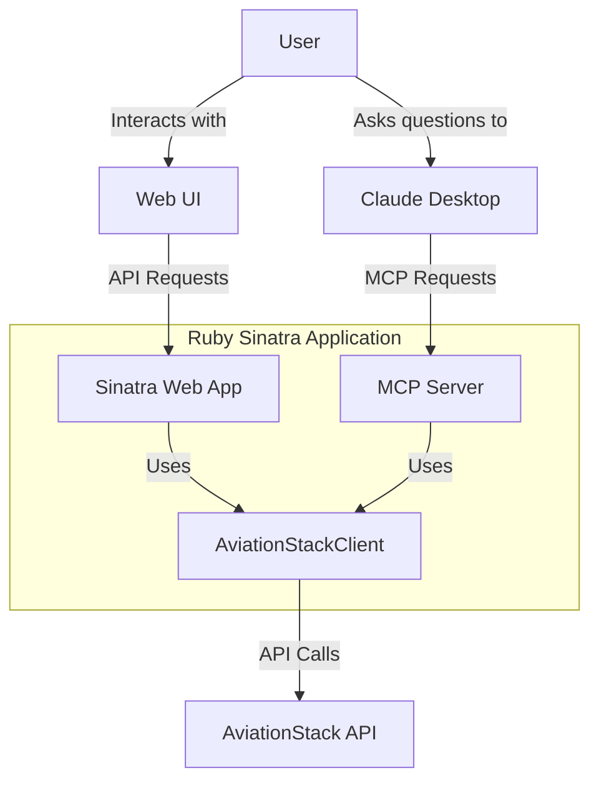

# Flight Tracking Chatbot with Ruby Sinatra and FastMCP

 

This project demonstrates a flight tracking chatbot built with Ruby, Sinatra, and FastMCP. The chatbot integrates with the AviationStack API to provide real-time flight information and status updates through Model Context Protocol (MCP) for AI-powered interactions.

**New to MCP?** Check out our [FAQ.md](docs/FAQ.md) to learn more about MCP servers, clients, and how they work together.

## Features

- Search for flights based on various criteria
- Get detailed flight status information
- Look up airport information
- Look up airline information
- Get current flight schedules
- Get future flight schedules for specific dates
- Modern web UI with dark/light theme toggle
- MCP integration for AI-powered interactions
- Ready to deploy to Tanzu Platform for Cloud Foundry

## Architecture Overview

This application uses a modular architecture that combines a web application with an MCP server:



For a detailed architecture description, see [ARCHITECTURE.md](docs/ARCHITECTURE.md).

## Prerequisites

- Ruby 3.3+
- Bundler
- AviationStack API Key (Get one at [AviationStack](https://aviationstack.com/signup/free))
- For Claude Desktop integration: Claude Desktop app
- For Cloud Foundry deployment: CF CLI and access to a Tanzu Platform for Cloud Foundry environment

## Quick Start

1. Clone the repository:

   ```bash
   git clone https://github.com/cf-toolsuite/tanzu-genai-showcase
   cd tanzu-genai-showcase/ruby-sinatra-fastmcp
   ```

2. Install dependencies:

   ```bash
   bundle config set --local path 'vendor/bundle'
   bundle install
   ```

3. Create a `.env` file based on the provided `.env.example`:

   ```bash
   cp .env.example .env
   ```

4. Edit the `.env` file and add your AviationStack API key:

   ```
   AVIATIONSTACK_API_KEY=your_api_key_here
   ```

5. Start the server:

   ```bash
   ./scripts/start-dev.sh
   ```

6. Visit `http://localhost:4567` to access the web UI

For detailed installation and setup instructions, see [DEVELOPMENT.md](docs/DEVELOPMENT.md).

## Documentation

- [ARCHITECTURE.md](docs/ARCHITECTURE.md) - System architecture, components, data flow
- [API.md](docs/API.md) - API documentation, endpoints, request/response formats
- [DEVELOPMENT.md](docs/DEVELOPMENT.md) - Development setup, workflow, best practices
- [DEPLOYMENT.md](docs/DEPLOYMENT.md) - Deployment instructions and environments
- [TESTING.md](docs/TESTING.md) - Testing strategies and procedures
- [TROUBLESHOOTING.md](docs/TROUBLESHOOTING.md) - Common issues and solutions
- [CLAUDE.md](docs/CLAUDE.md) - Claude Desktop integration details
- [FAQ.md](docs/FAQ.md) - Frequently asked questions
- [CONTRIBUTING.md](docs/CONTRIBUTING.md) - Contribution guidelines

## Web UI Features

The web UI provides a user-friendly interface to interact with flight data:

- **Dark/Light Theme Toggle**: Switch between dark and light themes based on your preference
- **Flight Search**: Search for flights by flight number, route, or airport
- **Schedules View**: View current and future flight schedules
- **MCP Tools Overview**: See all available MCP tools for AI integration

## API Endpoints

The application exposes several RESTful API endpoints:

- `GET /api`: API information
- `GET /api/search`: Search for flights
- `GET /api/airports`: Search for airports
- `GET /api/schedules`: Get current flight schedules
- `GET /api/future-schedules`: Get future flight schedules

For detailed API documentation, see [API.md](docs/API.md).

## MCP Integration

The application implements the Model Context Protocol (MCP) to enable AI assistants like Claude to interact with it. The following MCP tools are available:

- `FlightSearchTool`: Search for flights based on various criteria
- `FlightStatusTool`: Get detailed status information for specific flights
- `AirportInfoTool`: Get information about airports worldwide
- `AirlineInfoTool`: Get information about airlines
- `FlightSchedulesTool`: Get current flight schedules
- `FutureFlightSchedulesTool`: Get future flight schedules for specific dates

The MCP server supports two transport methods:
- **STDIO Transport**: Used by Claude Desktop for local development (default)
- **HTTP/SSE Transport**: Used for Cloud Foundry deployments to enable remote access via HTTP

For Claude Desktop integration instructions, see [CLAUDE.md](docs/CLAUDE.md).

For HTTP/SSE transport configuration, see [MCP_SSE.md](docs/MCP_SSE.md).

## Example Chat Interactions

Once the MCP server is connected to Claude, you can ask questions like:

- "What's the status of flight BA142?"
- "Find flights from JFK to LAX today"
- "Tell me about London Heathrow airport"
- "Which airlines fly from Singapore to Tokyo?"
- "Show me flight schedules for next week"
- "What are the future flight schedules for JFK on April 10th?"

## Testing

Run the test suite with:

```bash
bundle exec rake test
```

For detailed testing information, see [TESTING.md](docs/TESTING.md).

## Deployment

For detailed deployment instructions, see [DEPLOYMENT.md](docs/DEPLOYMENT.md).

## Contributing

We welcome contributions to this project! Please see [CONTRIBUTING.md](docs/CONTRIBUTING.md) for guidelines.

## License

This project is licensed under the MIT License - see the LICENSE file for details.

## Resources

### Core Technologies

- [Ruby](https://www.ruby-lang.org/en/) - Dynamic, open source programming language
- [Sinatra](https://sinatrarb.com/) - Lightweight web framework for Ruby
- [Fast-MCP](https://github.com/yjacquin/fast-mcp) - Ruby implementation of the Model Context Protocol
- [AviationStack API](https://aviationstack.com/) - Real-time flight information provider
- [Claude AI](https://claude.ai/) - AI assistant with MCP client capabilities
- [Model Context Protocol (MCP)](https://modelcontextprotocol.io/) - Protocol specification for AI model interactions
