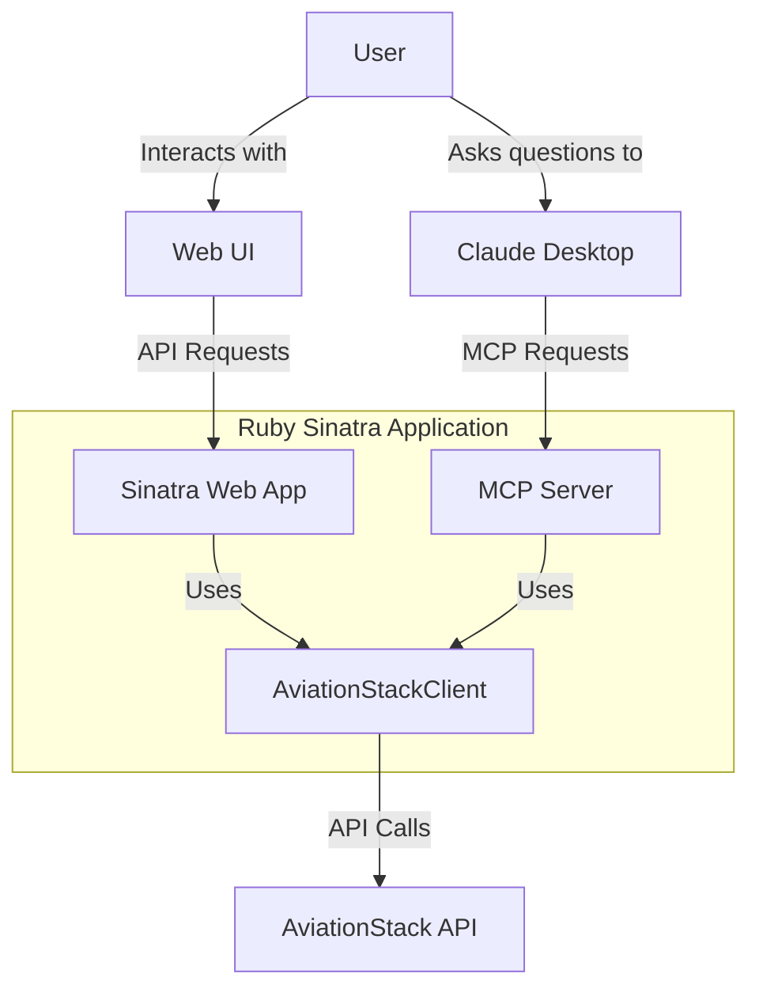
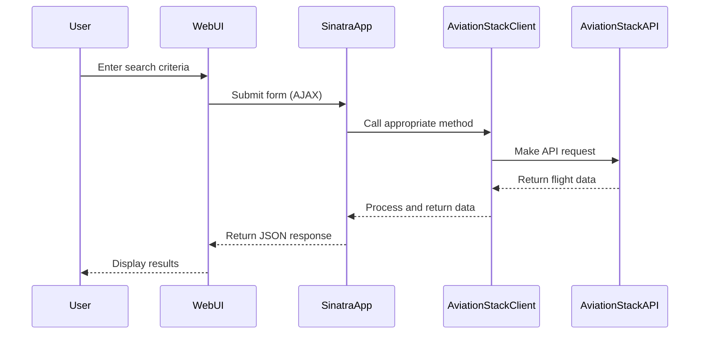
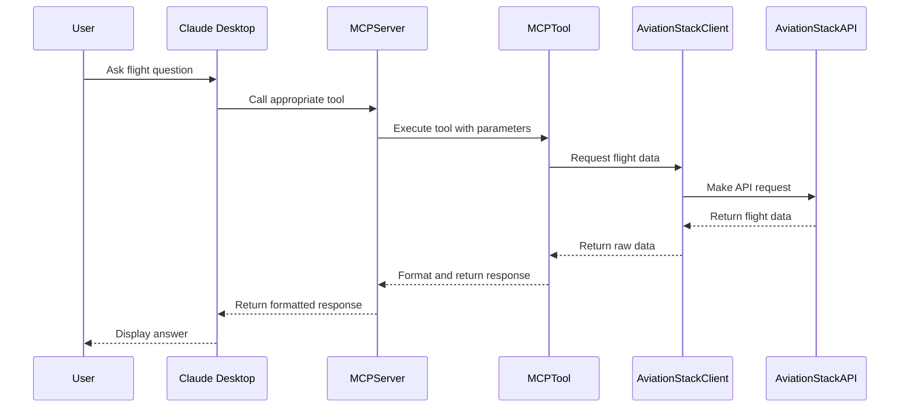
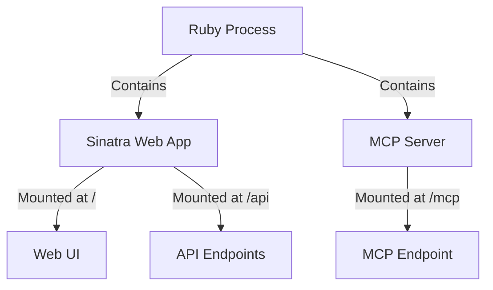
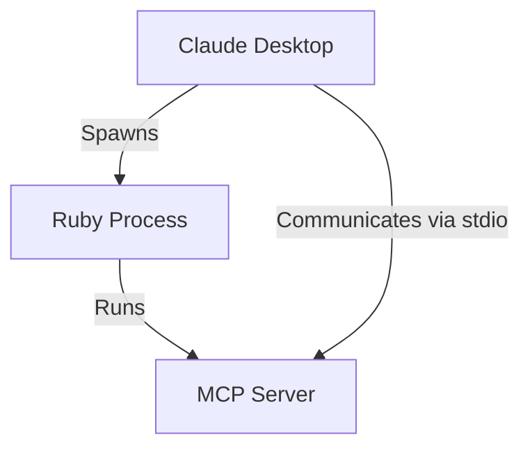
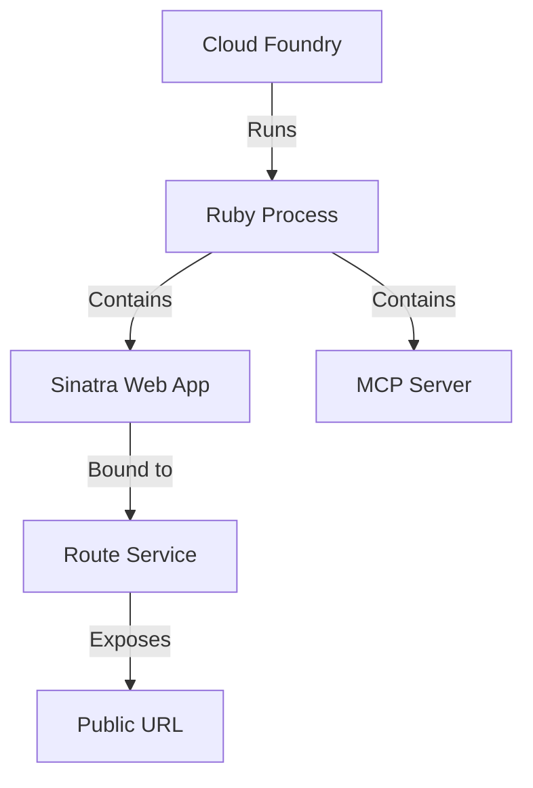

# System Architecture

This document provides a comprehensive overview of the Flight Tracking Chatbot's architecture, components, and data flow.

## Architecture Overview

The Flight Tracking Chatbot is built using a modular architecture that combines a web application with an MCP (Model Context Protocol) server. This design allows for both direct user interaction via a web interface and AI-powered interactions through Claude or other MCP-compatible clients.

## Core Components

### 1. Sinatra Web Application

The web application is built using Sinatra, a lightweight Ruby web framework. It serves as the entry point for user interactions through the web UI and provides RESTful API endpoints for flight data.

**Key Responsibilities:**

- Serve the web UI (HTML, CSS, JavaScript)
- Handle API requests for flight data
- Mount the MCP server for AI interactions
- Manage error handling and responses

**Implementation:**

- Located in `app.rb`
- Uses Rack for HTTP handling
- Implements RESTful API endpoints
- Renders ERB templates for the web UI

### 2. MCP Server

The MCP (Model Context Protocol) server enables AI models like Claude to interact with the application's functionality. It exposes a set of tools that AI models can use to search for flights, check flight status, and more.

**Key Responsibilities:**

- Register and expose MCP tools
- Handle requests from MCP clients (like Claude Desktop)
- Process tool calls and return formatted responses

**Implementation:**

- Located in `mcp_server.rb` (standalone) and integrated in `app.rb`
- Uses the Fast-MCP Ruby gem
- Registers tools from the `app/tools` directory

### 3. AviationStack Client

This component handles communication with the AviationStack API, which provides real-time flight data. It abstracts the API details and provides a clean interface for the rest of the application.

**Key Responsibilities:**

- Make HTTP requests to the AviationStack API
- Handle API authentication
- Process API responses
- Handle errors from the external API

**Implementation:**

- Located in `app/aviation_stack_client.rb`
- Uses Faraday for HTTP requests
- Implements methods for different API endpoints

### 4. MCP Tools

These are specialized classes that implement specific functionality for the MCP server. Each tool handles a specific type of flight-related query.

**Available Tools:**

- `FlightSearchTool`: Search for flights based on various criteria
- `FlightStatusTool`: Get detailed status information for specific flights
- `AirportInfoTool`: Get information about airports worldwide
- `AirlineInfoTool`: Get information about airlines
- `FlightSchedulesTool`: Get current flight schedules
- `FutureFlightSchedulesTool`: Get future flight schedules for specific dates

**Implementation:**

- Located in `app/tools` directory
- Each tool extends `FastMcp::Tool`
- Tools define arguments schema and implement a `call` method

### 5. Web UI

The web interface allows users to interact with the application directly through a browser. It provides forms for searching flights and viewing results.

**Key Features:**

- Flight search by flight number, route, or airport
- Schedule viewing
- Dark/light theme toggle
- Responsive design

**Implementation:**

- Located in `views` directory using ERB templates
- CSS in `public/css/styles.css`
- Client-side JavaScript for interactivity

## Data Flow

### Web UI Flow

### MCP Flow

## Technology Stack

### Core Technologies

- **Ruby**: Core programming language
- **Sinatra**: Lightweight web framework
- **Fast-MCP**: Ruby implementation of the Model Context Protocol
- **Rack/Puma**: Application server
- **ERB**: Templating engine
- **Faraday**: HTTP client for API requests

### Frontend Technologies

- **HTML/CSS**: Structure and styling
- **JavaScript**: Client-side interactivity
- **Feather Icons**: Icon library

### External Services

- **AviationStack API**: Source for flight data
- **Claude AI**: AI assistant with MCP client capabilities (optional integration)

## Configuration Management

The application uses a combination of environment variables and service bindings for configuration:

1. **Environment Variables**: Loaded from `.env` file in development
2. **VCAP_SERVICES**: Used in Cloud Foundry deployments
3. **VcapServices Module**: Abstracts the configuration loading logic

The `VcapServices` module in `config/vcap_services.rb` handles:

- Parsing VCAP_SERVICES in Cloud Foundry
- Extracting API keys and service credentials
- Providing fallbacks to environment variables

## Security Considerations

- API keys are stored in environment variables, not in code
- HTTPS is recommended for production deployments
- No user authentication is implemented in the current version
- API rate limiting is handled by the AviationStack API

## Deployment Architecture

### Local Deployment

In local deployment, both the web application and MCP server run in the same process:

### Claude Desktop Integration

When used with Claude Desktop, the MCP server runs as a separate process:

### Cloud Foundry Deployment

In Cloud Foundry, the application runs as a web application with the MCP server integrated:

## Extension Points

The application is designed to be extensible in several ways:

1. **Adding New MCP Tools**: Create new tool classes in the `app/tools` directory
2. **Adding New API Endpoints**: Add new routes in `app.rb`
3. **Adding New UI Features**: Enhance the web UI in the `views` directory
4. **Supporting New Data Sources**: Extend or replace the AviationStackClient

## Performance Considerations

- The application is designed to be lightweight and efficient
- API responses are passed through with minimal processing
- No database is used, reducing complexity
- Caching could be implemented to reduce API calls (not currently implemented)
