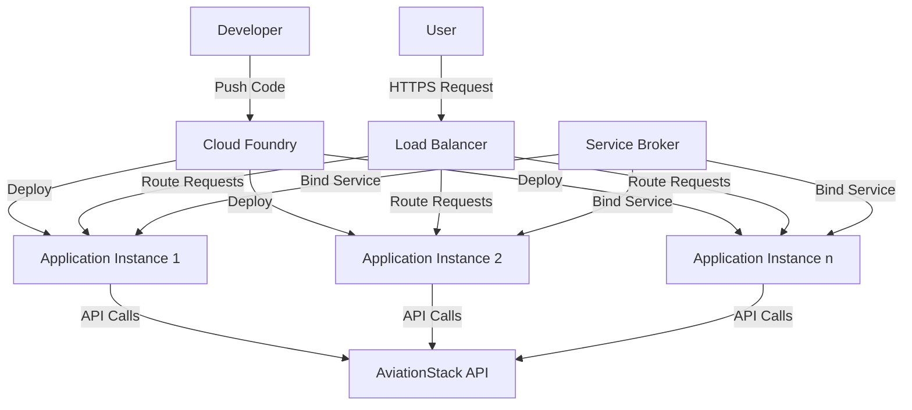

# Deployment Guide

This document provides comprehensive instructions for deploying the Flight Tracking Chatbot to various environments, with a focus on Tanzu Platform for Cloud Foundry.

## Deployment Options

The Flight Tracking Chatbot can be deployed in several ways:

1. **Local Development**: Running the application locally for development and testing
2. **Cloud Foundry**: Deploying to Tanzu Platform for Cloud Foundry
3. **Docker**: Running the application in a containerized environment (not covered in detail in this guide)

## Prerequisites

Before deploying, ensure you have:

- An AviationStack API key (get one at [AviationStack](https://aviationstack.com/signup/free))
- Ruby 3.3+ and Bundler installed (for local deployment)
- Cloud Foundry CLI installed (for Cloud Foundry deployment)
- Access to a Tanzu Platform for Cloud Foundry environment (for Cloud Foundry deployment)

## Local Deployment

### Development Environment

For local development deployment, follow these steps:

1. Clone the repository:

```bash
git clone https://github.com/cf-toolsuite/tanzu-genai-showcase
cd tanzu-genai-showcase/ruby-sinatra-fastmcp
```

2. Install dependencies:

```bash
bundle config set --local path 'vendor/bundle'
bundle install
```

3. Create a `.env` file based on the provided `.env.example`:

```bash
cp .env.example .env
```

4. Edit the `.env` file and add your AviationStack API key:

```
AVIATIONSTACK_API_KEY=your_api_key_here
```

5. Start the application:

```bash
./scripts/start-dev.sh
```

The application will be available at `http://localhost:4567`.

### Production-like Local Environment

To run the application locally in a production-like environment:

```bash
RACK_ENV=production bundle exec rackup -p 4567
```

This will:

- Disable automatic code reloading
- Enable production-level logging
- Disable detailed error pages

## Cloud Foundry Deployment

### MCP Server on Cloud Foundry

When deploying to Cloud Foundry, it's important to enable the HTTP/SSE transport for the MCP server so it can be accessed remotely. This is done by setting the `ENABLE_MCP_SSE` environment variable to `true` in the `manifest.yml` file.

With HTTP/SSE enabled, the MCP server will be accessible at:
- SSE endpoint: `https://your-app-url.cf-app.com/mcp/sse`
- Messages endpoint: `https://your-app-url.cf-app.com/mcp/messages`

This allows AI models and other clients to connect to the MCP server over HTTP instead of using STDIO transport (which only works locally). See [MCP_SSE.md](MCP_SSE.md) for more details on configuring and using the HTTP/SSE transport.

### Preparing for Deployment

1. Ensure you have the Cloud Foundry CLI installed and are logged in:

```bash
cf login -a <your-cf-api-endpoint> -u <your-username> -p <your-password> -o <your-org> -s <your-space>
```

2. Review the `manifest.yml` file and update it if necessary:

```yaml
---
applications:
- name: ((APP_NAME))
  memory: 512M
  instances: 1
  buildpacks:
  - ruby_buildpack
  env:
    AVIATIONSTACK_API_KEY: ((AVIATIONSTACK_API_KEY))

```

### Automated Deployment

We provide a deployment script that automates the process:

1. Set environment variables in your `.env` file:

```
APP_NAME=flight-tracking-bot
AVIATIONSTACK_API_KEY=your_api_key_here
```

2. Run the deployment script:

```bash
set -a; source .env; set +a
envsubst '${APP_NAME} ${AVIATIONSTACK_API_KEY}' < scripts/deploy-to-tanzu.sh > scripts/deploy.sh
chmod +x scripts/deploy.sh
./scripts/deploy.sh
```

### Manual Deployment

If you prefer to deploy manually:

1. Push the application without starting it:

```bash
cf push --no-start
```

2. Set the required environment variables:

```bash
cf set-env flight-tracking-bot AVIATIONSTACK_API_KEY your_api_key_here
```

3. Start the application:

```bash
cf start flight-tracking-bot
```

### Verifying Deployment

After deployment, verify that the application is running:

```bash
cf apps
```

You should see your application listed with status "running".

Access your application at the provided route:

```
https://flight-tracking-bot.your-cf-domain.com
```

## Environment Configuration

### Environment Variables

The application uses the following environment variables:

| Variable | Description | Required | Default |
|----------|-------------|----------|---------|
| AVIATIONSTACK_API_KEY | API key for AviationStack | Yes | None |
| PORT | Port to run the application on | No | 4567 (local), assigned by CF |
| RACK_ENV | Environment (development, test, production) | No | development |
| ENABLE_MCP_SSE | Enable HTTP/SSE transport for MCP server | No | false |

### Service Bindings

When deployed to Cloud Foundry, the application can use service bindings:

**User-Provided Services**: You can create user-provided services to store credentials

Example of creating a user-provided service for AviationStack:

```bash
cf create-user-provided-service aviationstack-service -p '{"AVIATIONSTACK_API_KEY":"your_api_key_here"}'
cf bind-service flight-tracking-bot aviationstack-service
```

## Multi-Environment Deployment

### Development Environment

- Uses local `.env` file for configuration
- Automatic code reloading enabled
- Detailed error pages
- Debug logging

### Test Environment

- Uses environment variables or service bindings
- Test-specific configuration
- Minimal logging

### Production Environment

- Uses service bindings for all credentials
- No detailed error pages
- Production-level logging
- Multiple instances for high availability

## Scaling

### Vertical Scaling

To allocate more resources to your application:

```bash
cf scale flight-tracking-bot -m 1G
```

### Horizontal Scaling

To run multiple instances of your application:

```bash
cf scale flight-tracking-bot -i 3
```

## Monitoring and Logging

### Viewing Logs

To view application logs:

```bash
cf logs flight-tracking-bot --recent
```

To stream logs in real-time:

```bash
cf logs flight-tracking-bot
```

### Health Checks

Cloud Foundry performs health checks on your application. You can customize the health check:

```bash
cf set-health-check flight-tracking-bot http --endpoint /api
```

## Troubleshooting Deployment Issues

### Common Issues

#### Application Fails to Start

If your application fails to start, check the logs:

```bash
cf logs flight-tracking-bot --recent
```

Common causes:

- Missing environment variables
- Invalid service bindings
- Ruby version compatibility issues

#### API Key Issues

If the application starts but cannot access flight data:

1. Verify the API key is correctly set:

```bash
cf env flight-tracking-bot
```

2. Check that the API key is valid by testing it directly with the AviationStack API

#### Memory Issues

If your application is running out of memory:

1. Increase the memory allocation:

```bash
cf scale flight-tracking-bot -m 1G
```

2. Optimize your application to use less memory

## Updating a Deployed Application

To update your application after making changes:

1. Push the updated code:

```bash
cf push flight-tracking-bot
```

2. If you've made changes to environment variables or service bindings, update them as needed:

```bash
cf set-env flight-tracking-bot NEW_VARIABLE new_value
cf restage flight-tracking-bot
```

## Backup and Restore

The application does not store persistent data, so traditional backup and restore procedures are not necessary. However, you should maintain:

1. Source code in version control
2. Documentation of environment variables and service bindings
3. Deployment scripts and configuration

## Security Considerations

### Secure Environment Variables

Never commit sensitive information like API keys to your repository. Always use environment variables or service bindings.

### HTTPS

Ensure your Cloud Foundry route uses HTTPS to encrypt data in transit. This is typically handled automatically by the platform.

### Access Control

Consider implementing access control if your application contains sensitive information or functionality.

## Deployment Architecture



## Additional Resources

- [Cloud Foundry Documentation](https://docs.cloudfoundry.org/)
- [Tanzu Platform Documentation](https://docs.vmware.com/en/VMware-Tanzu-Application-Platform/)
- [Ruby Buildpack Documentation](https://docs.cloudfoundry.org/buildpacks/ruby/index.html)
